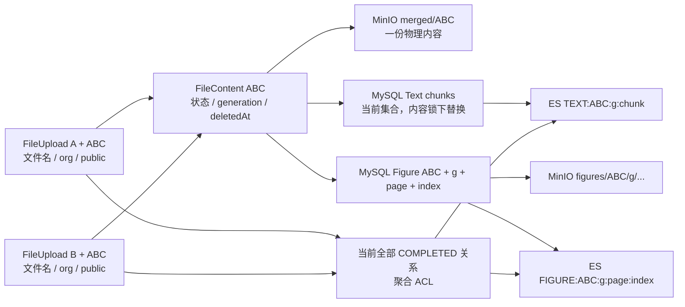
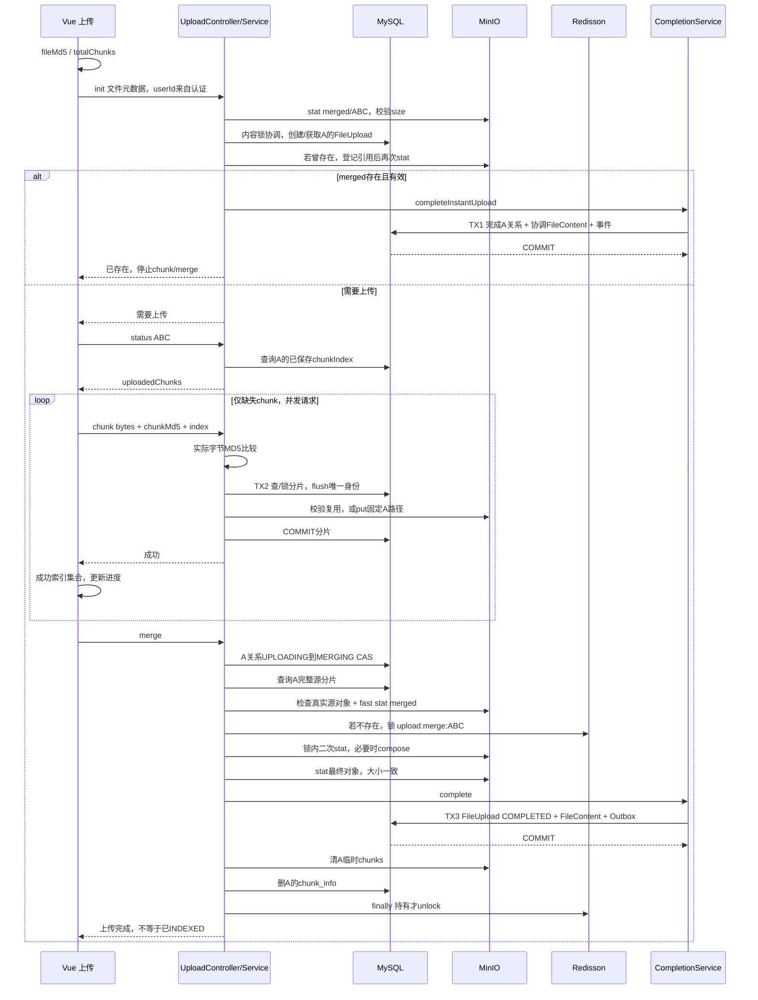
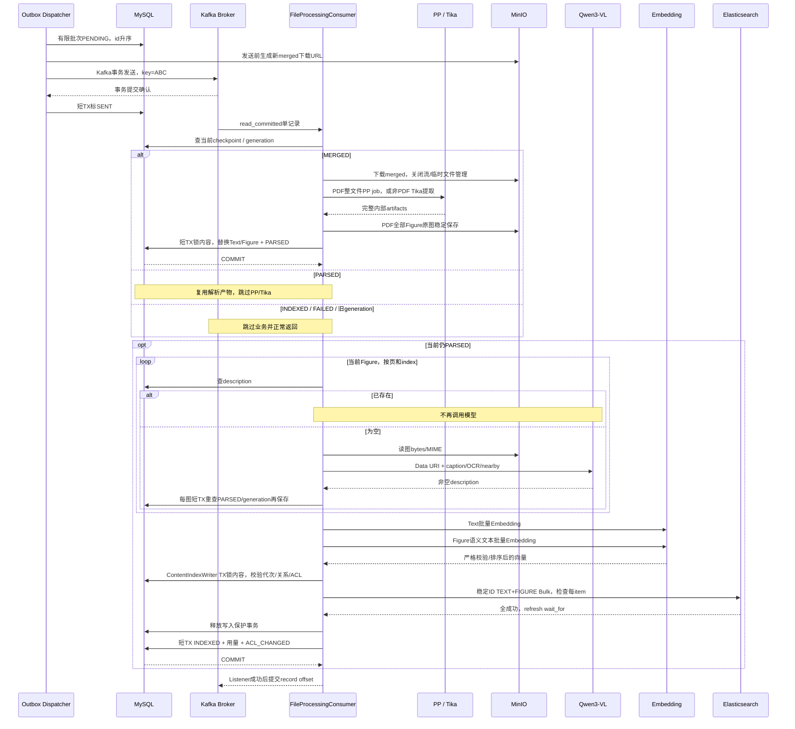
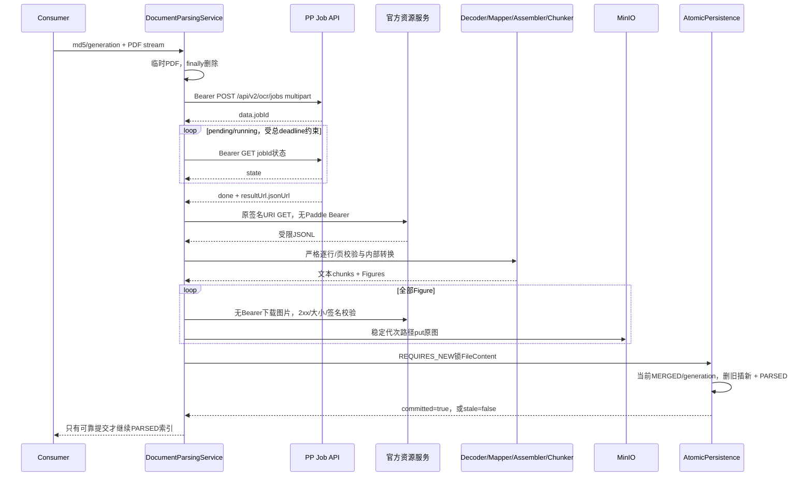
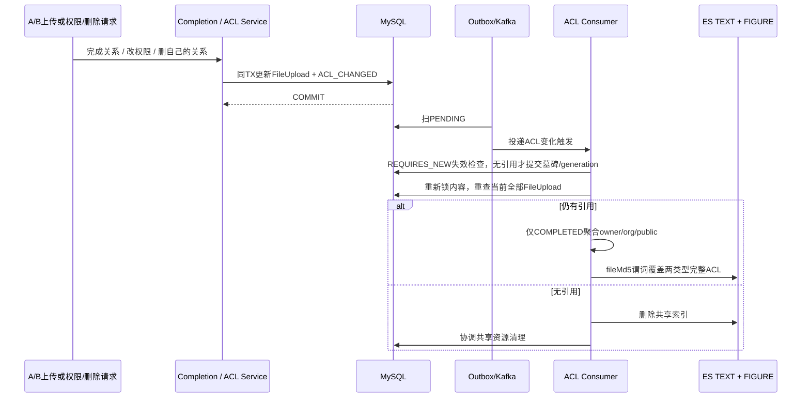
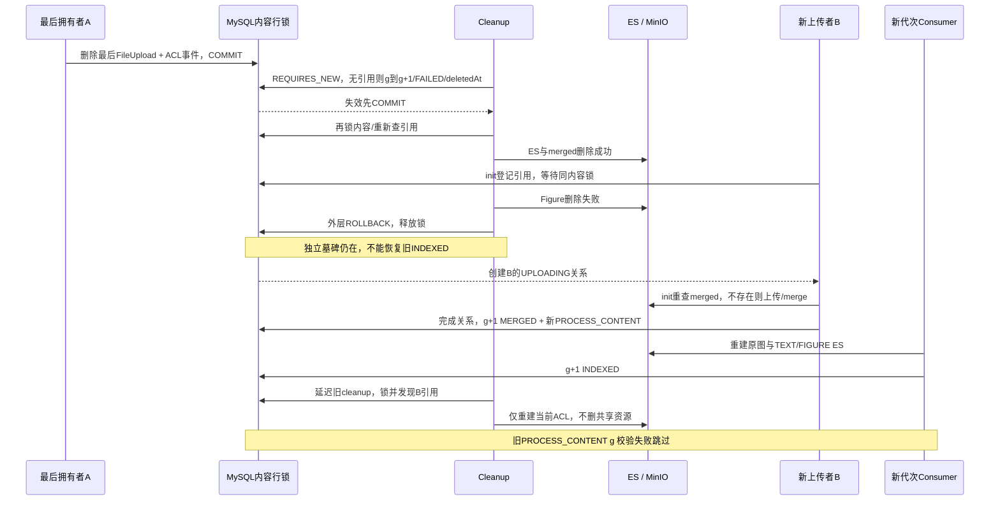
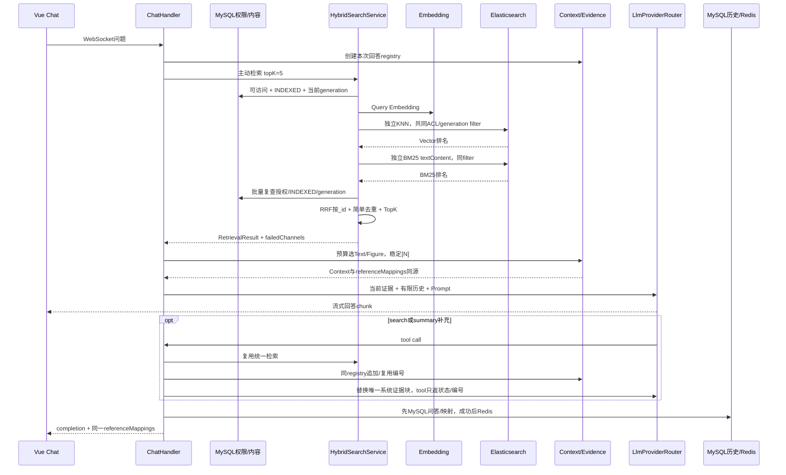
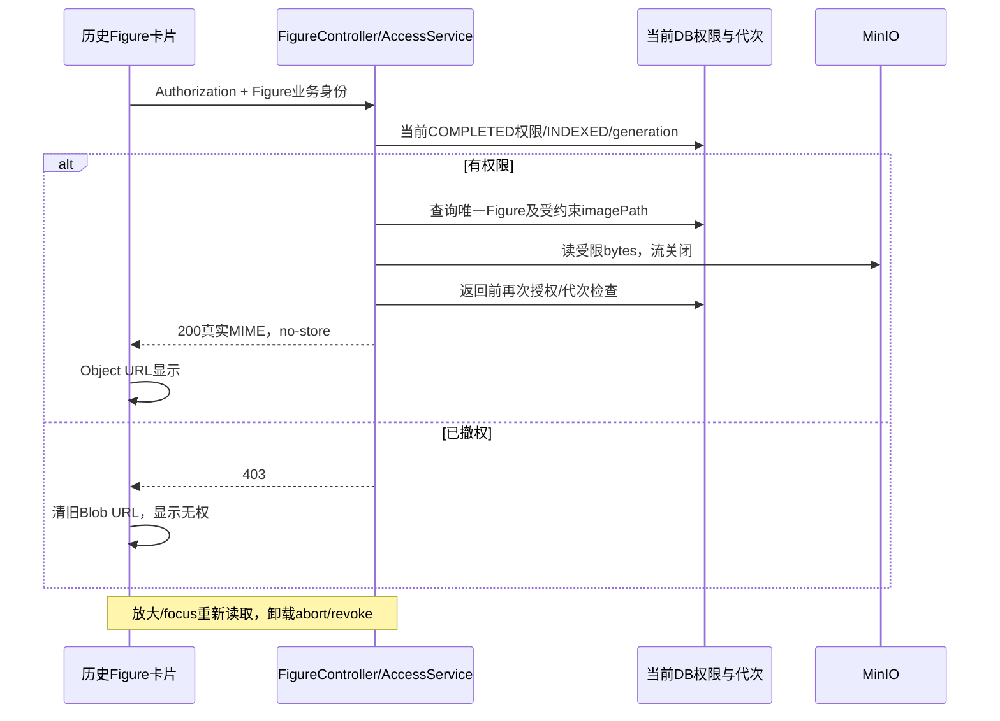

# PaiSmart：完整数据流与时序图

**基准：e8e330e，2026-10-07。**图中的“事务”默认指MySQL本地事务；Kafka事务另行注明。图用于理解真实顺序，不表示跨系统原子提交。MD5用ABC代替真实文档身份，A/B代替开发账号。

## 1. 身份与存储关系



说明：用户关系可以多份，内容只一份；Text还没有generation列，不能根据图误以为每一行有它。历史ES/图片可残留旧代次，但新检索只接受当前INDEXED generation。

## 2. 上传：Frontend → Backend → MySQL/MinIO → Merge → Outbox



TX2期间MinIO调用成功仍不代表MySQL提交成功；失败可留孤儿对象。TX3失败不能先清源；已有compose结果可下次复用。已INDEXED秒传只增ACL事件，不创建同代次内容处理事件。

## 3. A/B 并发 Merge：一次创建，多用户完成

```text
时间      A                                B
t1        A自己的CAS成功                    B自己的CAS成功
t2        stat merged不存在                 stat merged不存在
t3        获得upload:merge:ABC               等同一把锁
t4        锁内再查不存在，compose
t5        最终size有效，完成A/内容/Outbox
t6        清A的chunks，释放锁
t7                                          获锁，再查merged存在
t8                                          不compose，完成B/ACL事件
t9                                          只清B的chunks，释放锁
```

正常无故障条件下只有一次真正compose。本用户CAS与MD5锁保护不同对象，缺一不可。锁超时/compose失败不删源，状态恢复可merge；进程崩溃卡MERGING的自动恢复未实现。

## 4. 异步：Outbox → Kafka → Consumer → 解析/索引



图省略了“只有Text/只有Figure”时跳过不存在那组调用，但INDEXED必须至少有一个有效索引单元。ES Bulk在内容锁事务期间执行，不属于MySQL原子回滚资源；描述/Embedding在锁外。

### 关键故障窗口

```text
DB+Outbox成功 ── 崩溃 ── 尚未发送          => 重扫PENDING
Kafka成功    ── 崩溃 ── 尚未SENT          => 重复Kafka事件
PARSED成功   ── 崩溃 ── 尚未索引          => 复用解析产物
图1描述提交  ── 图2失败                   => 图1复用，补图2
ES部分成功   ── 异常                     => 同_id覆盖重试
ES全部成功   ── INDEXED事务失败            => PARSED过滤不可见，重试
INDEXED成功  ── 崩溃 ── offset未提交       => 当前代次跳过
```

普通业务异常保留checkpoint，约3秒间隔、首次+4次重试，耗尽确认DLT后FAILED。非法消息/框架不可重试错误可能直接恢复；不是所有错误都固定5次。

## 5. PDF job与原子PARSED



合法空白页可通过，但整个文档必须有可用Text或Figure。下载失败/非法页/图未保存不能提交PARSED。MinIO图像可能先保存、DB后失败，因此仍可能有孤儿；不声称分布式事务。

非PDF现代路径没有远程PP/图像步骤：Tika完整内存chunks → 同一个AtomicPersistence。page未知为null，不能凭空捏造页码。

## 6. ACL：FileUpload变化 → ACL_CHANGED → 当前状态重建



实际reconcile每次先调用独立checkpoint（有引用则no-op），再锁内容读关系。若无引用而checkpoint尚未准备，则抛出重试，不直接删资源。延迟事件永远按现在的关系计算，不把payload当旧ACL add/remove指令。权限投影失败重试，DLT后新Outbox继续重建。

### 并集示例

| 当前关系 | allowedUserIds | allowedOrgTags | public |
| --- | --- | --- | --- |
| A私有 | A | 空 | false |
| A私有、B共享ORG_X | A,B | ORG_X | false |
| 再有C公开 | A,B,C | ORG_X | true |
| B删除但另一拥有者也授ORG_X | 剩余拥有者 | ORG_X仍在 | 按剩余关系 |

授权关系创建的A1风险仍保留；该表只解释已有有效关系怎样投影。

## 7. A3：部分清理失败 + 新上传 + 延迟旧事件



若merged未删，B可以秒传复用字节，但同样在g+1重新处理，不能沿用旧INDEXED。merged没有generation目录，因此最后引用复查与登记必须同内容锁保护，不能只给旧图片路径加代次filter。

这是已覆盖的H2事务/线程竞态，EXT外删为替身；图不宣称做过真实跨系统故障实验。

## 8. 检索/RAG：Query → 两路 → RRF → Context → LLM → Reference



两路实际顺序执行、故障独立，图没有用par暗示并行。一条Figure既可Vector又可BM25；TEXT_ONLY是仅BM25通道名。

初始retrieval失败：不调用模型，FAILED/RETRIEVAL_FAILED。正常EMPTY仍可回答“资料不足”；DEGRADED明确提示证据可能不全。这不是“所有无答案都一样”的空列表。

Context最多12k字符证据，单条1.8k，按RRF顺序，不含内部路径。新回答重建registry，历史编号只属于历史；模型收到的历史视图去旧引用标记，DB原文不改。

## 9. Figure全链与安全展示

```mermaid
flowchart LR
    PDF["PDF"] --> PP["PP Layout / OCR"]
    PP --> F["Figure业务身份<br/>page + 页内index + label"]
    F --> O["原图MinIO稳定保存"]
    F --> M["caption / OCR / nearby"]
    O --> Q["Qwen3-VL<br/>Base64输入"]
    M --> Q
    Q --> D["description短事务持久化"]
    D --> E["caption + description + OCR<br/>文本Embedding"]
    E --> ES["稳定FIGURE ES document"]
    ES --> R["RetrievalResult"]
    R --> C["Context文本语义 + Evidence"]
    C --> L["DeepSeek等文本回答<br/>不重新接收原图"]
    L --> REF["[N] + referenceMappings"]
    REF --> ID["md5 + generation + page + index"]
    ID --> AUTH["认证图片接口<br/>当前DB权限/INDEXED/generation"]
    AUTH --> O
    AUTH --> UI["Blob缩略图 / 放大 / PDF页码"]
```



### 撤权后历史图片



后端不接受任意imagePath，前端/history JSON也不依赖它。已下载bytes不能收回，旧PDF预签名到期边界仍保留。这个接口阻止后续未经授权读取，不能倒转用户之前获得的内容。

## 10. 用图自查，不背图

对任意一个节点问“之后崩溃怎么办”。如果回答是“事务回滚”，必须指明哪个事务、哪些MySQL行；如果是“重试”，必须指明从哪个checkpoint、用哪个稳定身份、是否重复费用；如果是“权限检查”，必须指出当前事实源与A1边界。

图中的外部请求不会因MySQL rollback消失；跨系统可靠性来自可重发意图、完成checkpoint、稳定产物、代次过滤与再查权限，而非一个包住所有步骤的@Transactional。
