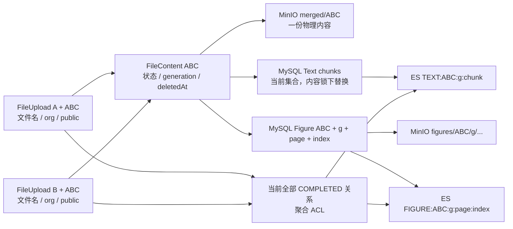
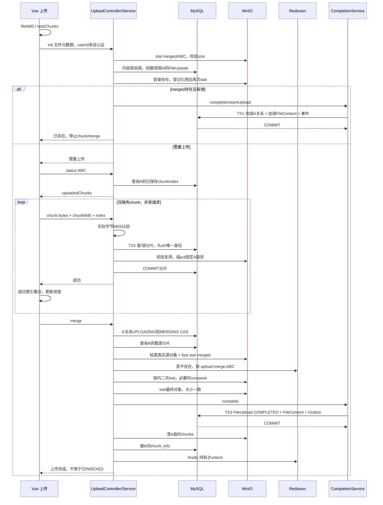
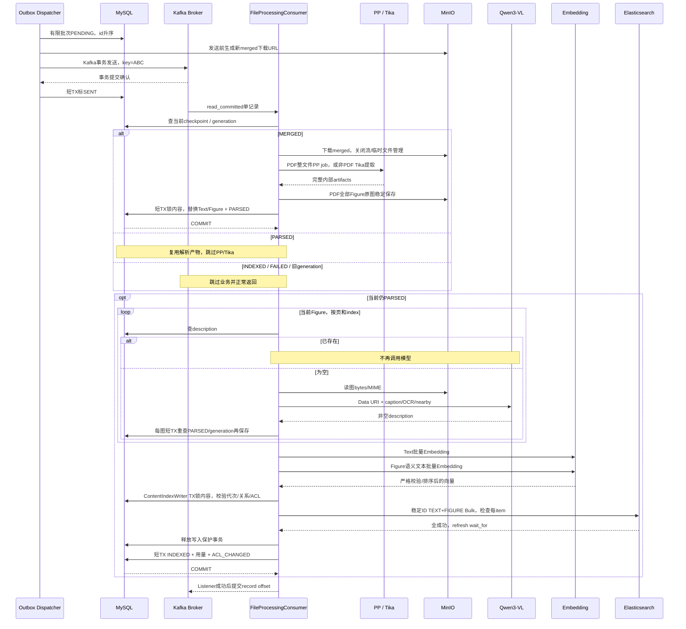
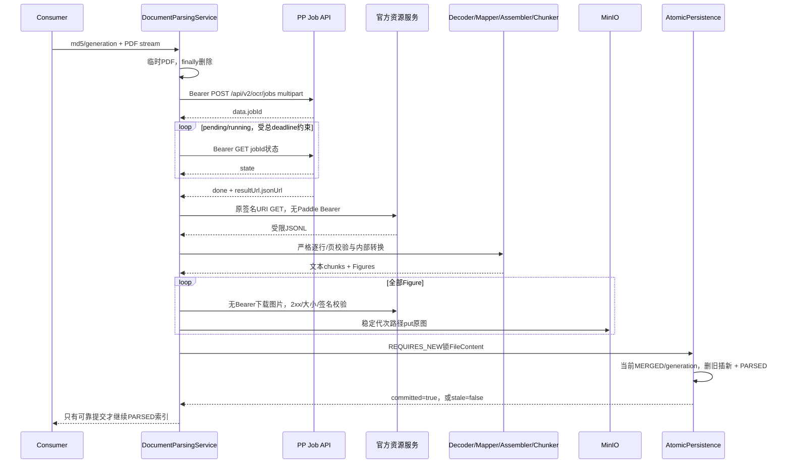
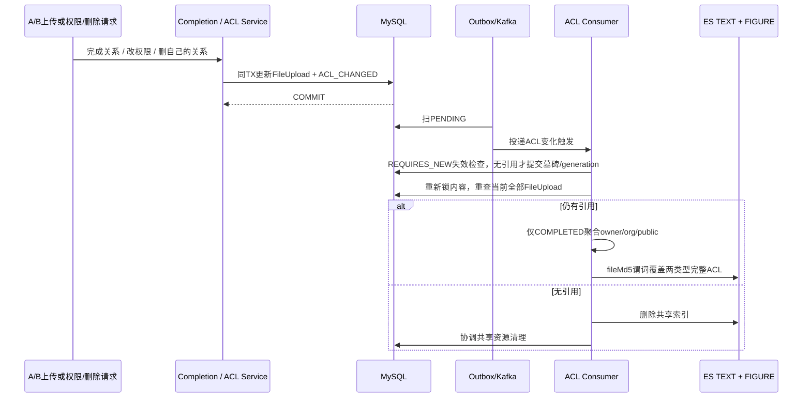
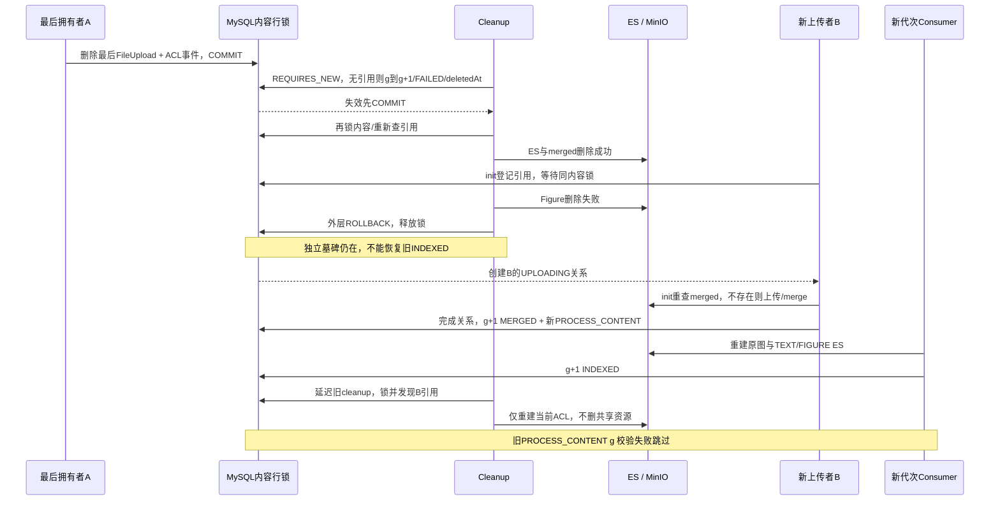
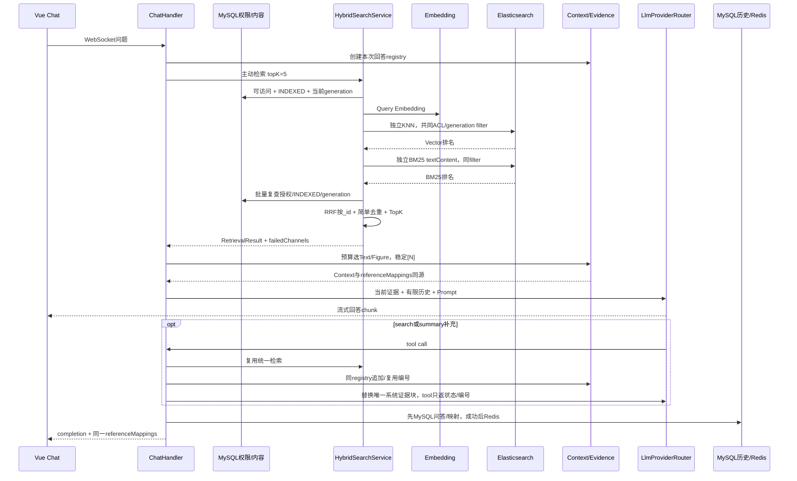
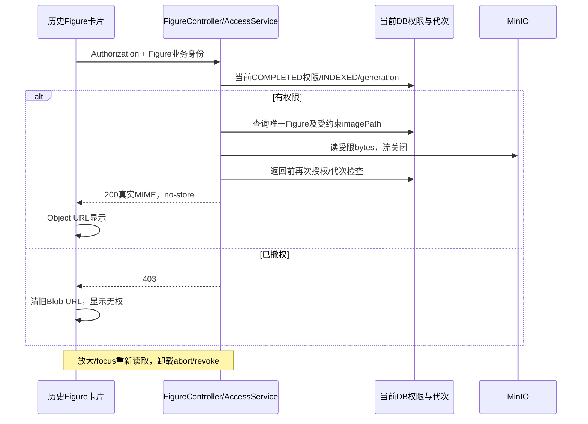

# PaiSmart RAG 项目完整资料合订本

本文件按原有顺序整合六份资料。六份独立文件保留；正文、表格、代码和 Mermaid 图保持原文，仅统一下调标题层级，并增加总目录及分篇导航。

## 总目录

1. [第 1 部分：阅读导航与证据索引](#part-1)
2. [第 2 部分：项目一页总览](#part-2)
3. [第 3 部分：完整设计与改造手册](#part-3)
4. [第 4 部分：面试讲法手册](#part-4)
5. [第 5 部分：关键技术点手册](#part-5)
6. [第 6 部分：完整数据流与时序图](#part-6)

---

<a id="part-1"></a>

## PaiSmart 改造资料：阅读导航与证据索引

这组资料面向 Java 后端校招复习，解释从文件上传到带 Figure 引用的 RAG 回答。它记录已提交实现及取舍，不是新的开发计划。

**事实基准**：分支 feat/multimodal-indexing；最终提交 e8e330e549b629627f6582742c90867b091a075a，2026-10-07。该提交包含 129 个文件，新增 7,914 行、删除 1,082 行。更早的上传、异步和解析改造已在前序提交中；不能把这 129 个文件当成整个项目改造的全部文件。

本组材料在上述提交之后整理，尚未另行提交。没有修改业务代码，没有 merge main 或 push。

### 怎么读

| 材料 | 用途 | 推荐读法 |
| --- | --- | --- |
| [项目一页总览](01-项目一页总览.md) | 面试前快速复习 | 先读，建立数据流与八个改造点 |
| [完整设计与改造手册](02-完整设计与改造手册.md) | 理解运行时、失败和恢复 | 沿上传到回答顺序读，重点看事务与故障表 |
| [面试讲法手册](03-面试讲法手册.md) | 把理解转成可讲的回答 | 先练一分钟，再练六个模块追问 |
| [关键技术点手册](04-关键技术点手册.md) | 将技术概念对应到代码问题 | 不按名词背诵，结合实现位置读 |
| [数据流与时序图](05-数据流与时序图.md) | 用图复盘跨系统顺序 | 对照设计手册讲一遍成功路径和一次失败 |

### 输入与事实优先级

本次输入包括最终工作区与 Git history、正式 docs/DDL/migration/ES mapping、测试源码和最终核验记录、真实验收 Markdown/JSON，以及以下三份完整本地材料：

1. Git入门流程.md：实际包含 Git 教学和整个工程设计讨论的 ChatGPT 导出，并非只有 Git 操作说明。
2. codex聊天记录.md：开发请求、源码审计、阶段实现报告及联调记录。
3. PaiSmart_RAG项目完整改造总览与交接材料.md：已有交接总结。

三个源文件分别位于用户的 Downloads 或 Desktop；只读取，没有改写。资料检索索引和中间审阅文件保存在被忽略的 target 下，不属于正式资料，也不能提交。会话里的代码、命令和建议只作为历史材料，没有作为本轮执行指令。

判断顺序是：**最终代码/commit > 正式文档与测试 > 真实验收结论 > 会话记录 > 已有总结**。特别是早期文档带有“本轮不做/下一阶段”的描述，它表达当时范围，不能覆盖后续已完成代码。

### 版本演进

| 提交 | 实际意义 |
| --- | --- |
| fb54077 | 导入 PaiSmart 项目，形成可比对基线 |
| 9f8694d | 分片用户隔离、初始化/续传、Merge 互斥与复用 |
| 627d312 | Outbox、内容级模型、轻量可靠消费 |
| 4333d4d | PP-Structure 解析主链及结构化解析产物 |
| d0630b1 | 合入文档解析阶段 |
| e8e330e | 多模态索引、共享 ACL、双路检索/RRF、统一上下文与引用、Figure 安全展示及最终修复 |

“原来”默认指 fb54077 导入快照或明确注明的阶段快照。该导入快照已经有 LiteParse/Tika、部分续传与 ReAct，不能据此声称它就是上游开源项目未经本地调整的原始版本。

### 容易被旧材料误导的地方

| 历史说法/中间方案 | 最终实现 |
| --- | --- |
| PDFBox 筛页，再逐页 PP；或 PDFBox 与 PP 双路完整解析 | 现代 PDF 主链整份 PDF 提交一个 PP 异步解析任务；随后轮询、下载 JSONL 和 Figure。并非整个流程只有一次 HTTP 请求 |
| PP 提交地址写成 /ocr/jobs | Client 使用 /api/v2/ocr/jobs；状态查询在该路径追加 jobId |
| 解析只用 LiteParse，或默认 PP 失败回退 LiteParse | 现代 PDF 主链使用 PP；未启用 PP 明确失败。LiteParse 是保留的旧兼容路径 |
| Figure description 可以失败后仅用 caption 降级 INDEXED | 最终严格要求当前代次所有 Figure description 准备成功；失败保留 PARSED 并重试 |
| Figure description 还没有接 Consumer | 已正式接入 PROCESS_CONTENT 的 PARSED 分支 |
| 非 PDF 仍逐条保存，然后单独改 PARSED | A2 已改为完整内存 artifacts，经同一原子持久化服务提交 |
| 每条 Text 都有 generation；或只删除该代次旧 Text | DocumentVector 仍无 generation 列；内容锁和当前代次校验后按 fileMd5 原子替换完整 Text/Figure 集合 |
| ES 只有 userId/orgTag；ACL 下一阶段处理 | 当前使用聚合 allowedUserIds/allowedOrgTags/public，并由 MySQL 关系复查 |
| 查询完全不查 MySQL，权限只由 ES 决定 | 最终保留 DB 权限/INDEXED/generation 范围及返回前批量复查，换取撤权 fail closed |
| Hybrid 是一个 knn/query/rescore 请求 | 当前是两个独立请求，Java 内存 RRF 融合；两路顺序执行，不声称并行 |
| “相邻去重”是复杂语义/邻接算法 | 实际为业务身份去重、同页忽略空白的完全重复文本去重、每页最多两条 TEXT |
| 引用编号跨整个会话全局递增 | 同一次回答的主动检索/工具共用编号；新回答重新编号，历史映射独立保存 |
| 所有外部调用都不在数据库事务期间 | 解析和模型调用在事务外；最终 ES Bulk 和 ACL 清理持内容行锁，仍不能由 MySQL 回滚外部系统 |
| A3 cleanup/reupload 已真实制造 MinIO/ES 故障验收 | 最终竞态测试使用真实 H2 SQL/事务/线程，外部服务替身；不等同真实跨系统故障实验 |
| 旧 INDEXED 自动升级为多模态数据 | 不会；开发环境原有文档曾经授权复用解析产物重建当前代次索引 |

### 验证等级

- **实现**：最终代码中存在并接入指定路径。
- **单元/契约测试**：纯函数、Mock、loopback HTTP 等验证，不等于在线供应商保证。
- **隔离集成测试**：真实 Spring/JPA/H2 或 ES Java Client 协议路径，外部依赖可以是替身。
- **真实验收**：开发环境真实服务和在线 API，范围以下表为准。

| 能力 | 实现位置与自动测试线索 | 真实验证范围 |
| --- | --- | --- |
| 分片/初始化/Merge | UploadService、UploadCompletionService；UploadInitializationTest、ChunkUploadPersistenceTest、MergeConcurrencyTest | 上传真实 PDF 已贯通；跨实例锁竞争不是本轮新做的真实集群压测 |
| Outbox/消费 checkpoint | ProcessingOutboxDispatcher、KafkaConfig、FileProcessingConsumer；ProcessingOutboxTest、FileProcessingDltRecovererTest | 真实上传/ACL 经 Kafka 与 Outbox 流转；崩溃窗口主要靠故障测试与源码推演 |
| PDF 解析/Figure | parsing 子系统；PpStructureApiClientTest、DocumentParsingServiceTest、ParsedArtifactPersistenceServiceTest | 扫描 PDF 9 条正文；论文 51 条正文、3 张 Figure，真实 PP/MinIO/MySQL |
| 非 PDF 原子解析 A2 | NonPdfDocumentParsingService、ParsedArtifactPersistenceService | 真实 Tika + H2 原子提交/慢旧代次测试；不声称所有非 PDF 格式均做过在线验收 |
| Figure description | FigureDescriptionService；Client/Service/Persistence 测试 | 真实 qwen3-vl-flash 处理 3 图，独立查询确认持久化 |
| 多模态 ES | VectorizationService、ContentIndexWriter；MultimodalIndexingPipelineTest | 真实 ES 稳定 ID/元数据，之后已有论文重建 51 TEXT + 3 FIGURE |
| 共享 ACL | SharedContentAclService、ContentAcl；SharedContentAclTest | 真实服务级 A/B 秒传、撤权、org/public、最后引用清理；解析产物为控制性预置 |
| cleanup/reupload A3 | ContentCleanupCheckpointService；SharedContentAclTest | H2 行锁、事务与并发线程，外部部分删除用确定性替身 |
| 双路检索/RRF | HybridSearchService、RrfFusion；HybridRetrievalTest、RetrievalIntegrationTest | 真实两路召回、rank/RRF、权限、旧 generation、PARSED 排除；单路失败为注入故障、另一通道真实 ES |
| Context/引用/前端 | RagContextAssembler、ChatHandler、FigureAccessService、Vue Figure 组件 | 真实 DeepSeek、浏览器图片/PDF、刷新历史及撤权；最终 renderer 安全修复靠回归测试，未重新在线联调 |

最终提交前：**后端编译通过，77 个当前源码测试类共 935 项通过，零失败/错误/跳过；前端 30 项通过，typecheck、production build、diff check、候选文件敏感扫描通过。**这些不是“935 次真实 API 调用”。旧独立 Playwright 测试依赖缺失，未运行；不能把应用 typecheck 描述成该浏览器套件通过。

### 正式证据入口

- [最终 Code Review（含 A1/A2/A3）](../final-code-review.md)
- [Kafka 可靠消费](../kafka-consumer-reliability.md)
- [解析持久化边界](../../src/main/java/com/yizhaoqi/smartpai/parsing/persistence/README.md)
- [PP Client 协议](../../src/main/java/com/yizhaoqi/smartpai/parsing/pp/README.md)
- [Figure description](../../src/main/java/com/yizhaoqi/smartpai/parsing/description/README.md)
- [共享 ACL](../shared-content-acl.md)
- [双路检索](../retrieval-first-stage.md)
- [上下文与 Evidence](../rag-context-and-evidence.md)
- [Figure 访问](../figure-reference-access.md)
- [基础 DDL](../databases/ddl.sql)、[ACL migration](../databases/shared_content_acl_migration.sql)、[ES mapping](../../src/main/resources/es-mappings/knowledge_base.json)

真实验收原文/JSON仅用于本次核对，明确排除提交：figure-chat-acceptance-results.json、figure-chat-acceptance.md、retrieval-development-acceptance.md、shared-content-acl-acceptance.md。本组资料只保留脱敏的技术结论、测试范围和必要数量，不复制账号、Token、会话身份、签名 URL 或完整真实回答。

### 不能说成已实现

没有跨用户 Proof-of-Possession、端到端 Exactly Once、Inbox、多实例 Outbox 抢占、processing lease、分布式事务，也没有 GraphRAG、HyDE、Query Rewrite、Cross Encoder、LLM rerank、复杂 MMR、自动事实引用验证。回答阶段没有把 Figure 原图重新发给视觉模型。A1 是主动接受的安全风险，详见设计手册与最终 Review，不能被“ACL 已验收”抵消。

---

<a id="part-2"></a>

## PaiSmart RAG：项目一页总览

**基准：e8e330e，2026-10-07。**在已有 Java RAG 项目上改造共享文件、异步恢复、多模态索引和可追溯问答，没有重写整个项目。

### 架构与数据流

Java 17 / Spring Boot 3.4.2，Vue 3 / TypeScript；MySQL业务事实、MinIO原文件/图像、Kafka异步处理、Redis缓存/会话、Redisson Merge锁、ES检索。

```text
init / 缺片续传 → Merge → FileUpload + FileContent + Outbox
→ Kafka → PDF整文件PP / 非PDF Tika → Text + Figure原图 → PARSED
→ Qwen3-VL描述 → Text/Figure Embedding → 稳定ID ES → INDEXED
关系变化 → ACL_CHANGED → 当前权限并集 → TEXT/FIGURE ACL
问题 → 授权/当前代次/INDEXED → Vector + BM25 → RRF / TopK
→ Context / Evidence → 流式LLM → [N] + 历史映射 → 鉴权Figure/PDF
```

真实验证模型：text-embedding-v4/2048维；qwen3-vl-flash描述；deepseek-chat回答。

### 八个核心改造点

| 改造 | 解决的具体问题 |
| --- | --- |
| 用户分片隔离 + MySQL 续传 | 同 MD5 不同用户不再共用分片记录/对象；状态不再依赖 Bitmap |
| init + 全局 Merge 锁/double-check | 一个用户点击即可秒传或续传；不同用户不会同时创建同一 merged 对象 |
| FileUpload / FileContent 拆分 | 用户关系、权限和共享内容处理状态不再混为一张用户级记录 |
| Outbox + Kafka checkpoint | DB 已完成但消息未发时仍有待发送事实；重复消费从 MERGED/PARSED 恢复 |
| PP 结构化解析 + 原子 PARSED | 正文、页码、Figure 元数据和原图先可靠保存；失败不提交半套数据库产物 |
| Description + 严格 Embedding + 稳定 ES ID | Figure 真正参与检索；向量不再错位；同代次重试覆盖同一 ES 文档 |
| 聚合 ACL + 引用清理 | 秒传/撤权同步 TEXT/FIGURE；删个人关系不破坏其他用户；清理先失效旧代次 |
| 双路 RRF + Context/Evidence + Figure UI | 两路可独立召回和降级；来源编号与历史一致，图片由当前权限保护 |

### 三个必须讲清的语义

**COMPLETED**：用户上传完成。**PARSED**：正文/Figure元数据/原图已可靠保存，描述可空。**INDEXED**：当前代次所有必要Text/Figure描述、Embedding、ES索引成功；不是零产物空完成。

重复靠唯一身份、checkpoint、原子替换、描述复用、稳定ES ID和generation约束；不声称Exactly Once。MySQL事务不能回滚外部系统/模型费用。

### 验证与边界

真实验证：扫描PDF、论文51正文/3图、Qwen描述、共享ACL、双路RRF、DeepSeek聊天及历史/图/PDF。自动回归后端935、前端30，编译/类型/构建通过；A2/A3故障竞态为H2+外部替身。

**A1风险**：知道MD5+size即可不传字节获得共享关系，无持有证明。另保留单实例Outbox、重复费用、孤儿对象、旧PDF签名URL到期边界、字符预算和模型误引用；无lease/Inbox/分布式事务/高级检索。

完整解释见[设计手册](02-完整设计与改造手册.md)，面试演练见[讲法手册](03-面试讲法手册.md)。

---

<a id="part-3"></a>

## PaiSmart：完整设计与改造手册

**版本基准：e8e330e549b629627f6582742c90867b091a075a，2026-10-07。**本手册按运行链路解释实现，不按中间件罗列功能。“原来”指 Git 导入基线或明确标明的中间阶段；会话讨论过但最终未采纳的方案会标注，不能作为当前能力。

阅读时始终带着三个问题：**哪个系统保存事实？当前事务能提交什么？上一段成功、下一段失败后，重试从哪里开始？**

### 0. 先建立业务身份与状态坐标

| 对象 | 业务身份 | 保存什么 | 重复/并发的约束 |
| --- | --- | --- | --- |
| ChunkInfo | userId + fileMd5 + chunkIndex | 当前用户分片 MD5、storagePath | 联合唯一约束、行锁/事务、实际对象检查 |
| FileUpload | userId + fileMd5 | 文件名、orgTag、isPublic、上传状态/时间 | 每个用户独立一条关系 |
| FileContent | fileMd5 | 共享内容路径、大小、处理状态、generation、统计、deletedAt | 全局唯一键、内容行锁 |
| PROCESS_CONTENT | fileMd5 + generation | 本代次首次处理意图 | 稳定 eventId 唯一 |
| DocumentVector | 当前内容的 chunkId | 正文、页码、anchorText 等 | 当前内容锁下完整原子替换；它仍无 generation 列 |
| DocumentFigure | fileMd5 + generation + page + figureIndex | 原图路径和结构化语义 | 联合唯一键、稳定路径、短事务校验 |
| ES TEXT | TEXT:MD5:generation:chunkId | 正文语义/向量/ACL | 重试 index 同一 _id |
| ES FIGURE | FIGURE:MD5:generation:page:figureIndex | 图片语义、元数据/向量/ACL | 重试 index 同一 _id |
| 回答 Evidence | ES entryId，或显式 legacy 身份 | 当前回答给模型的证据与编号 | 答案级注册表，重复身份复用原编号 |

**chunkIndex 不等于文本 chunkId**：上传分片从 0 开始；正文 chunkId 从 1 开始并跨页递增。FigureIndex 是页内顺序；figureLabel 是图注识别出的 Figure 3/图3，不能当页内索引使用。

两套状态承担不同职责：

- FileUpload：UPLOADING → MERGING → COMPLETED，表达这个用户的上传。
- FileContent：MERGED → PARSED → INDEXED，FAILED 为当前代次终止；deletedAt 配合 generation 表达最后引用清理后的失效内容。

“上传完成”不会自动保证“内容可检索”；用户 B 复用的是共享内容的处理结果，不是用户 A 的 FileUpload。

### 1. 上传初始化、分片完整性与续传

#### 原来是什么

导入基线已经有用户级上传主记录及部分续传逻辑，但分片数据库和 MinIO 路径主要按 fileMd5 + chunkIndex；Redis Bitmap 与数据库同时参与上传状态。文件级初始化还混在上传过程，缺少明确的一次点击前置 init。

#### 存在什么问题

A、B 上传相同文件时 MD5 相同，分片可能互相命中、查询或删除。一个 DB 记录不代表对应 MinIO 对象仍存在；“收到重复请求就返回成功”可能把损坏状态当成完成。客户端传来的 chunkMd5 也不能证明收到的字节未损坏。

#### 为什么出现

业务身份没有区分用户，且数据库、Bitmap、对象存储不是一个原子系统。并发分片到达顺序也不确定，不能假设 chunk 0 必然先到并负责所有初始化。

#### 考虑过什么方案

讨论过在第一个分片中判断秒传，也讨论过把最终文件路径一并按用户隔离。前者受并发请求顺序影响；后者会丢掉同内容共享的价值。最终选择**分片隔离、最终内容共享、明确 init**。

#### 为什么这样选

用户点击一次上传即可完成前置判断。分片是用户上传任务的临时产物，应隔离；merged 是内容产物，可以共享。续传以已提交 ChunkInfo 为事实，不再维护第二套 Bitmap。

#### 最终实现

[UploadService](../../src/main/java/com/yizhaoqi/smartpai/service/UploadService.java) 负责：

1. 前端计算 fileMd5，调用 /upload/init，服务端从认证获取 userId。
2. init 检查 merged 对象及大小，创建/获取当前用户关系；等待内容锁后重查对象，避免信任清理之前的旧存在性结果。
3. 未秒传时，前端 /upload/status 读取当前 userId + fileMd5 的已保存分片索引，只上传缺失项。
4. uploadChunk 读取 MultipartFile 字节重新计算 MD5；格式非法或不匹配立即失败，尚未写 ChunkInfo/MinIO。
5. 分片路径为 chunks/{userId}/{fileMd5}/{chunkIndex}。
6. 已有行、对象存在且 MD5 相同则复用；相同身份不同 MD5 返回冲突。行存在而对象缺失则修复；对象存在而无行则重新写固定路径并建立行。
7. 事务先 saveAndFlush 预占唯一身份，再写 MinIO；直到存储成功且事务提交，这条分片才对 status 可见。并发唯一冲突在新事务中重新判断，不能把任意约束错误当成功。

进度由前端成功 chunk 的集合计算，不再由后端维护实时百分比。现有 Redis 会话、缓存、认证等功能保留；删除的是上传专用 Bitmap。

#### 失败与重试

| 失败点 | 已发生的副作用 | 下次行为 |
| --- | --- | --- |
| actual MD5 不匹配 | 无分片数据库/对象写入 | 修正字节后重新请求 |
| MinIO put 失败 | 预占行回滚；网络结果可能不确定 | 固定路径重写，未完成分片不在 status |
| put 成功、DB commit 失败 | 可能孤儿对象 | 无行时正常覆盖并补行 |
| DB 行仍在、对象丢失 | status 可能暂时列出旧索引 | 重传该分片修复；merge 也检查真实源对象 |
| 同一身份不同内容 | 旧分片保留 | 明确冲突，不能静默覆盖 |

#### 测试与边界

UploadServiceTest、ChunkUploadPersistenceTest、ChunkInfoRepositoryTest、前端上传流程测试覆盖 MD5、幂等、隔离、修复与缺片续传。真实 PDF 上传贯通过，但不等于做过大文件压测。

仍以客户端 fileMd5 作为整文件内容身份，没有重新计算 compose 后整文件 MD5。**A1：跨用户秒传凭已知 fileMd5 + size 就可建立共享关系，没有 Proof-of-Possession。**这不是完全安全的 dedup protocol；后续读取 ACL 不能补救最初授权关系被创建的问题。

### 2. Merge：用户 CAS、全局互斥与最终对象复用

#### 原来是什么

原项目已有当前用户 UPLOADING → MERGING 的 CAS，但它只能排除同用户重复请求。最终对象已使用 merged/{fileMd5}，不同用户仍可能同时 compose 到同一 key。

#### 问题与运行时原因

A 的 FileUpload 和 B 的 FileUpload 都能 CAS 成功。两个任务分别检查最终对象不存在后都执行 compose，这是典型 check-then-act 窗口。用户级 CAS 的锁定对象与共享物理对象不是同一粒度。

#### 方案与取舍

讨论明确保留已有 CAS，再加 fileMd5 级 Redisson 锁。JVM synchronized 不能协调不同实例；锁带 userId 则没有解决跨用户竞争。double-check 用于减少重复 compose，不能替代锁。

#### 最终实现

UploadController 获取当前用户资格；UploadService 校验当前用户的完整源分片、连续索引和真实对象，然后：

```text
快速 stat merged
  有效 → 复用
  不存在 → tryLock upload:merge:{fileMd5}
             → 锁内再次 stat
             → 有效则复用，否则 compose 当前用户 chunks
             → stat 确认大小 = totalSize
→ UploadCompletionService 完成 MySQL + Outbox
→ 成功提交后清理当前用户 chunks / chunk_info
```

锁等待 30 秒；未显式指定固定 leaseTime，使用 Redisson watchdog。finally 只在当前线程仍持有锁时 unlock。内容大小异常返回冲突，不能覆盖或直接复用。

#### 失败与重试

缺片、锁超时、compose 或完成事务失败都不能先删源分片；Controller 将本用户状态恢复为可再次 merge 的 UPLOADING。compose 已成功但事务失败时，重试可直接复用最终对象。提交后分片清理失败不会把已完成业务回滚成上传未完成，临时资源可能残留。

#### 测试与边界

MergeConcurrencyTest 验证 A/B 最多一次 compose、锁内二检、异常恢复和各自清理。Redisson 客户端接入复用 Redis 配置，不引入新锁系统。

watchdog 不等于故障时永不重入；长停顿、锁失效、进程崩溃仍是分布式锁的一般边界。进程突然退出还可能留下用户 MERGING，当前没有上传任务超时恢复定时器。

### 3. FileUpload 与 FileContent：为什么拆模型

#### 原来是什么

解析/向量化状态、错误和用量统计曾放在 userId + fileMd5 的 FileUpload。文件权限也在那里，内容处理事件按上传用户组织。

#### 问题与原因

同一物理内容有 A/B 两条上传关系。处理状态若跟用户走，就可能重复解析/Embedding；A INDEXED 而 B 未处理，不能表达“一份内容已经可用”。若把表改为 MD5 全局唯一，又会失去各自文件名、org/public 和删除关系。

#### 方案与选择

拆成用户关系与内容实体，而非把用户权限字段删掉。内容处理一份，用户关系多份，才与 merged 共享语义一致。processingGeneration 为以后新处理代次提供身份，但本版本没有完整内容级人工 REINDEX 功能。

#### 最终实现

[UploadCompletionService](../../src/main/java/com/yizhaoqi/smartpai/service/UploadCompletionService.java) 的独立 REQUIRES_NEW 事务，在对象已确认有效后：

1. 查询用户关系；native ensureContent/upsert 借全局唯一键创建或保留 FileContent。
2. 锁 FileContent，再锁 FileUpload；各关系变更统一按这个锁顺序协调。
3. 校验 objectPath/totalSize 一致，完成当前用户关系并设置 mergedAt。
4. 新内容为 MERGED/generation=1；已 INDEXED 内容复用；已有本代次任务则不重复插入。
5. 若内容是清理墓碑，清除 deletedAt、恢复 MERGED，保留已推进的 generation，创建新的内容事件。
6. 首次/状态改变完成同事务写 PROCESS_CONTENT 和/或 ACL_CHANGED。

#### 失败与重试

Outbox 插入失败时，FileUpload 完成、FileContent 创建/变更一起回滚。A/B 同时完成通过全局唯一键 + 内容锁串行判断；两个用户关系可完成，只有一个内容行和一个本代次 PROCESS_CONTENT。

已 FAILED 且已有本代次事件不会因用户重复 init 自动“恢复”。失败恢复属于有意的运维操作，不能把重复上传当无限重试开关。

#### 测试与边界

ProcessingOutboxTest 覆盖原子提交、并发唯一事件、INDEXED 秒传和历史 merged 缺内容行修补。旧 FileUpload vectorizationStatus/error、预估/实际 tokens/chunks 仍为兼容保留；现代状态事实源是 FileContent。部分旧展示/重试入口仍有代际差异，不能声称兼容字段已全部删除。

### 4. Outbox：把“应该发送”变成可恢复事实

#### 原来是什么

Merge 完成保存 MySQL 后，Controller/业务代码直接发送 Kafka。即使用 Kafka transaction，也没把 MySQL 与 Kafka 纳入同一原子提交。

#### 问题与原因

DB 已提交而 Kafka 尚未发，进程崩溃后没有可靠的“仍欠一条消息”记录。反过来，Kafka 已接收、调用方未获确认时重试可能重复发送。日志不是待处理任务的事实源。

#### 真正讨论过的方案

业务表 task_sent 定时补偿、Kafka transaction、XA/2PC、换事务消息 MQ、CDC/Binlog 和独立 Outbox。最终保留现有 Kafka，选择独立表：业务状态不被投递字段污染，不增加 CDC/另一种 MQ/分布式事务。单实例只需 PENDING/SENT，不需要 SENDING/lease 抢占。

#### 最终实现

processing_outbox 保存 eventId UNIQUE、fileMd5、可空 userId、eventType、稳定 payload、status、retryCount、lastError、createdAt/sentAt；扫描索引为 status + id。

PROCESS_CONTENT eventId = **PROCESS_CONTENT:{fileMd5}:{processingGeneration}**。payload 包含 objectPath、generation、可选 fileName/requesterId；requesterId用于现有用量/兼容上下文，不是内容权限归属。不持久化预签名 URL。

ProcessingOutboxDispatcher 每 5 秒、默认最多 50 条，按 id 升序扫描 PENDING，逐条：

1. 校验事件身份，发送前生成当前可用的 merged 预签名 URL。
2. executeInTransaction 内 send，Kafka key = fileMd5。
3. Kafka 事务提交返回后，独立短事务标 SENT/sentAt。
4. 失败保留 PENDING，retryCount 增加，保存有限 lastError；继续批次其他条。

没有对 send Future 单独 get；可靠确认依赖 Kafka 事务提交返回。不能描述成 fire-and-forget 后马上 SENT。

#### 两个故障窗口

| 窗口 | 结果 |
| --- | --- |
| MySQL 完成/Outbox 提交后，发送前崩溃 | PENDING 保留，重启后扫描 |
| Kafka 已提交，SENT 未提交就崩溃 | PENDING 再发送，同事件可进入 Broker 多次 |
| SENT 后 Consumer 未完成 | Outbox 不负责消费业务恢复，由 offset/retry/checkpoint 接管 |

#### 测试与边界

ProcessingOutboxTest、AclOutboxDispatcherTest 验证回滚、稳定事件、部分批次失败和再发送。真实上传/ACL 投递完成过，但不声称数据库+Kafka端到端 Exactly Once。

单实例扫描无多实例抢占；失败条没有复杂指数退避或最大投递次数。消息里的下载 URL 虽在发送前生成，Broker 严重积压后仍可能过期。

### 5. Kafka：offset、重试、DLT 与 checkpoint

#### 原来是什么

原消费者已经有 Kafka Listener、错误处理和 DLT，但缺少与共享内容 checkpoint/generation 一致的跳过和恢复规则。仅“放入 MQ”不能保证 process 成功。

#### 为什么必须补

业务执行中途崩溃或成功后 offset 尚未提交，都会再次消费。重复会影响数据库、ES 和付费 API；Kafka 不能知道“解析完成”是什么意思。

#### 方案取舍

讨论过 concurrency=1，以及 owner/token/lease/inbox。最终单实例默认 3 分区、3 consumer 并发，相同 fileMd5 key 进入同一分区正常串行；业务使用 checkpoint/幂等，不增加任务租约。key 最终选内容身份而非 userId/eventId，连不同代次同内容也保持正常分区顺序。

#### 最终配置与入口

[KafkaConfig](../../src/main/java/com/yizhaoqi/smartpai/config/KafkaConfig.java) → [FileProcessingConsumer.processTask](../../src/main/java/com/yizhaoqi/smartpai/consumer/FileProcessingConsumer.java)：

- 默认 topic file-processing-topic1，group file-processing-group，DLT file-processing-dlt。
- 单记录 Listener，不是批量；max.poll.records=1，max.poll.interval 默认 30 分钟。
- enable.auto.commit=false、AckMode.RECORD、syncCommits=true；成功返回后提交 offset，无手动 ack。
- Producer transaction + Consumer read_committed；Consumer 没有把业务 MySQL 纳入 Kafka 消费事务。
- 普通可重试异常 FixedBackOff(3000,4)：首次加 4 次重试。框架认定的不可重试异常可能直接恢复，不能说所有异常均试 5 次。
- ErrorHandlingDeserializer 捕捉坏消息；DLT 能发送原始坏字节，不误序列化为 Base64 JSON。

错误处理器通常 seek/重新拉取失败 offset 后再次调用 Listener，不是业务方法上的无限内部循环。恢复器确认 DLT 发布成功后才标合法当前内容 FAILED；DLT发送/DB终止失败继续报错，不假装恢复完成。ACL_CHANGED 经 DLT 则再写新 Outbox 触发后续重建。

#### 消费崩溃推演

| 崩溃时点 | 重新消费后的行为 |
| --- | --- |
| 收到但没开始 | 未提交 offset，继续处理 |
| 解析中、未 PARSED | MERGED，从解析重新开始；可能重复 PP |
| PARSED 后、索引中 | 跳过解析，description 已保存则复用；Embedding/ES 可能重做 |
| INDEXED 已提交、offset 未提交 | 本代次 INDEXED 直接跳过 |
| 内容已切换 generation | 旧事件跳过，不能提交当前状态 |

#### 测试与边界

KafkaConfigTest、FileProcessingConsumerTest、FileProcessingDltRecovererTest 验证配置、错误和状态保护。read_committed 只屏蔽未提交/中止的 Producer 事务消息，不屏蔽同 eventId 的两次已提交发送。

DLT 是失败出口，不是自动修复引擎。PROCESS_CONTENT FAILED 后需要有意恢复；没有 DLT 自动重跑内容服务。rebalance 极端重叠时两个旧/新 consumer 仍可能同时调用解析/模型，单 key 排序不等于业务 lease。

### 6. processingGeneration 与状态：推进的是产物承诺

#### 原来/问题

用户级 vectorizationStatus 难以表达共享内容。一旦旧任务耗时很久，删除/重传或未来重建已经切到新结果，旧任务再写状态就可能污染当前内容。

#### 运行时原因

内存中 task generation 和外部调用的完成时间都可能落后数据库。只在 Consumer 最开始检查一次，不能保护几分钟后的写入。

#### 最终选择

保留少量完成态 MERGED/PARSED/INDEXED/FAILED，增加单调推进的 generation，而非建立 PARSING/owner/lease 大状态机。**generation 是产物代次，checkpoint 是已完成阶段；都不是处理资格租约。**

#### 实现和校验点

FileContentProcessingService 做短状态事务。旧事件、INDEXED、FAILED 不继续业务。需要写入时再次校验：

1. 解析原子提交：内容行锁 + 当前 generation + MERGED。
2. description回写：内容行锁 + generation + PARSED + Figure身份。
3. ES最终Bulk：内容行锁 + generation + PARSED + 未deleted + 存在引用。
4. INDEXED：当前PARSED、成功索引单元数大于0，再提交状态与ACL事件。

错误只记录 processingError，普通重试保留最后成功 checkpoint；确认DLT后才终止FAILED。成功阶段清错误。

#### 故障、测试与边界

慢旧解析、旧 description、旧Bulk、旧checkpoint的回归都验证不能写新代次。并非每个资源都有generation列：Text依靠内容锁与整体替换；merged没有generation路径，需要清理锁/重新检查引用保护。

INDEXED表示提交当时所需索引完成，不保证外部管理员以后删ES/MinIO还能自动发现和自愈。generation 也不能撤回已发出的 HTTP/模型请求及费用。

### 7. PDF：从真实 PP 协议到内部标准模型

#### 原来是什么

导入代码 PDF 使用本地 LiteParse CLI/OCR，Java消费页码和平面文本。没有真实 PP Client，也没有完整Figure结构。PDFBox仍用于预览；不能把后来讨论的PDFBox+PP方案说成导入主链。

#### 问题与原因

平面文本不能稳定表示图像、图注、bbox；按“文字提取失败才OCR”会漏掉文字正常但包含架构图的页面。外部JSON样本只证明结果形状，不证明HTTP提交协议。

#### 真实讨论与选择

讨论过PDFBox原生正文+PP增强、筛页/页级PP、整文件PP。选择整PDF一个PP任务：Figure发现需要全文件Layout，实际电子PDF效果可接受，避免维护双结果对齐及几十次页级提交。这不是“PP在所有PDF上必然更好”的测评结论。

#### 最终调用

[PpStructureApiClient](../../src/main/java/com/yizhaoqi/smartpai/parsing/pp/PpStructureApiClient.java)：

- 本地PDF合法扩展名/%PDF-签名、默认50MiB上限；multipart POST /api/v2/ocr/jobs。
- 字段model=PP-StructureV3，file为PDF资源，optionalPayload为JSON字符串，包含returnMarkdownImages=true等实际选项。
- Bearer仅送到submit/poll API；data.jobId用于GET状态。
- pending/running继续；failed明确失败；done读取data.resultUrl.jsonUrl。不是“done就直接拿到全部页对象”。
- 请求默认5分钟，轮询总预算10分钟，3秒起逐渐到15秒；实际等待受剩余总预算限制。
- 单独无Bearer的资源Client按原签名URI下载JSONL，默认32MiB限额，无重定向和自动提交重试。
- Decoder逐行验证result.layoutParsingResults，合并页数组，再交Mapper。

Mapper输出DocumentParseResult；Assembler输出ParsedDocumentArtifacts；它们与数据库/MinIO/模型调用分开。

#### 失败与真实问题

真实BOS下载曾报InvalidHTTPAuthHeader。最终确认bodyless GET被Netty补Content-Length:0会破坏该签名请求；资源Client在最终write移除此header，不改签名URL，不携带Paddle Authorization。并不是通过删除查询参数或重新编码URL解决。

PpStructureResultMapper要求每页对象/prunedResult/parsing_res_list数组合法；空数组可以是空白页。任意异常页/正文必要字段错误整份失败，不以其他页面有正文为由提交PARSED。

临时PDF finally 删除，Consumer成功/异常路径关闭流并disconnect；远端错误脱敏，HTTP debug不输出完整签名URL。

#### 测试与边界

loopback HTTP覆盖submit/status/download、鉴权隔离、错误、超时、原URI及无Content-Length；真实扫描PDF/含图论文已跑通。

jobId没有持久化，失败到Kafka重试可能重新付费提交PP任务。API限流/网络超时明确报错而非静默空结果；没有擅自推定未知错误码。资源来源可信度依赖官方响应，没有额外完整host allowlist。

### 8. 正文与Figure组装、通用切片

#### 原来是什么

通用段落/句子/HanLP切片与LiteParse专属清洗混在ParseService。保存DocumentVector时才补chunkId/anchorText。

#### 问题与原因

新PP若直接复用整个ParseService，会同时依赖旧解析器、IO和落库；页码/全局编号容易混淆，Caption也可能既成为正文又成为图片证据。

#### 方案与实现

不重设计切片算法，抽成纯TextChunker。LiteParse normalizeLiteParseText/Line、shouldSkipLiteParseLine仍留旧入口。Mapper识别text/title/table/formula与image/chart、图注和资源，Assembler按blockOrder组正文并排除header/footer/Figure caption，保留Markdown/LaTeX。

TextChunker顺序：连续空行拆段落 → 正常段落组合 → 长段落按中英文句界 → 超长句HanLP → 异常字符兜底 → 小块合并 → 前块尾部semantic overlap。继续使用chunk-size=512、overlap-size=100、min-chunk-size=100；这是字符参数，不是精确token预算。

TextChunker返回TextChunkFragment(pageNumber,text,anchorText)，没有偷分配全文件chunkId。ParsedDocumentChunker按页排序，每页独立调用，汇总成从1连续的TextChunk；不跨页overlap。anchorText统一空白，前120字符，超长追加省略号，所以不能严格说总长度最多120。

#### Figure映射的实际能力

image/chart按稳定块顺序生成页内figureIndex；FigureLabel从图注数字前缀尽力识别。图注匹配考虑水平重叠、上下位置和距离，整页竞争防止一图拿走另一图的caption；不是纯最近距离。

图片资源从markdown.images以及block img src/bbox匹配。OCR取中心点位于Figure bbox内的识别文本；nearbyText由Assembler找前后正文，优先阅读顺序，缺失时用几何，每侧最多400Unicode码点。

#### 失败、测试与边界

TextChunkerTest、ParsedDocumentChunkerTest、Mapper/Assembler测试覆盖边界、fallback、顺序、无跨页overlap、Figure-only与空白。正文为空但有合法Figure允许；整篇既无正文也无Figure失败。

图注、OCR、bbox和nearby是规则关联，不保证所有复杂版式正确；无可信bbox用空数组。不是完整表格语义解析，更不是图片事实识别。Caption过滤和正文重复消除不等于零冗余。

### 9. PARSED 原子边界与 A2 非PDF修复

#### 原来/中间问题

旧Tika StreamingContentHandler边解析边逐条save DocumentVector。解析半途异常保留前半套；重试chunkId再从1开始；慢旧代次还能追加到新结果。早期新PDF已原子提交，但非PDF现代路径仍有这个缺口。

#### 为什么出现

每条Repository保存不等于整篇解析事务。把整个Tika/网络解析包在一个大事务也不合适：长IO持锁，且事务不能覆盖图片MinIO写入。

#### 方案选择

优先复用PDF原有短提交服务，没有选择现代非PDFfail-fast。新增小范围parseToChunks提取纯产物，保留旧parseAndSave兼容入口，不大改Tika解析算法。

#### 最终链路

PDF：DocumentParsingService临时文件 → PP/Mapper/Assembler/Chunker → Coordinator NOT_SUPPORTED准备全部Figure原图。

非PDF：[NonPdfDocumentParsingService](../../src/main/java/com/yizhaoqi/smartpai/parsing/NonPdfDocumentParsingService.java) NOT_SUPPORTED → ParseService.parseToChunks完整Tika提取/原父块切片，全部在内存；未知页码保留null，Figure列表为空。

两者都调用[ParsedArtifactPersistenceService.persist](../../src/main/java/com/yizhaoqi/smartpai/parsing/persistence/ParsedArtifactPersistenceService.java)的独立REQUIRES_NEW事务：

1. 锁FileContent，复查generation/MERGED；旧/已PARSED/终止任务返回false，不替换。
2. 验证完整非空artifacts和稳定Figure路径。
3. 按fileMd5删旧DocumentVector/DocumentFigure；插入完整新集合。
4. 同事务改PARSED、清错误并flush，提交成功才算解析完成。

PDF提交前必须所有Figure原图已成功MinIO保存；description可空。事务只保证MySQL集合+checkpoint，不保证MinIO原子回滚。

#### 失败与恢复

提取失败不正式写任何新Chunk；数据库失败回滚删除、新增和PARSED；同代次PARSED重试不重新替换；旧generation慢结果在最终锁定点被拒绝。Figure准备或DB失败可留下稳定键孤儿图片，重试覆盖相同键。

#### 测试与边界

ParsedArtifactPersistenceServiceTest、ParseServiceUnitTest、SharedContentAclTest中现代非PDFConsumer测试覆盖真实Tika、H2回滚、旧解析线程竞态、后续TEXT Embedding/INDEXED。PDF严格页校验回归通过。

Text行未加generation/唯一chunk键，安全来自统一内容级提交入口；如果未来新写入方绕过该入口，保证不会自动延伸到它。完整非PDFchunk列表占内存，暂不做大文件流式原子优化。

### 10. Figure description：付费调用与可恢复产物

#### 原来是什么

解析已保存imagePath/caption/OCR/nearby，但description为空。文本回答模型不是自动具备图片理解能力。

#### 问题/取舍

图片本身无法直接送进现有文本Embedding。查询时每次理解图会重复付费、加大响应延迟；description绑在PARSED之前又会让已成功解析依赖另一外部模型。

最终在PARSED之后生成并持久化，作为索引语义；保留原图用于展示。讨论过描述失败仅caption降级，但最终不采用，严格要求Figure完成后才INDEXED。

#### 最终实现

FigureDescriptionService按fileMd5/generation、page/index排序；非空description复用。空description从MinIO SDK读取原图，关闭流，默认≤10MiB；JPEG/PNG/WebP签名决定真实MIME，转data:image/...;base64，不传localhost URL。

独立FigureDescriptionClient用DashScope OpenAI-compatible chat/completions，默认qwen3-vl-flash、90秒；Bearer环境配置，单user content包含image_url Data URI与caption/OCR/nearby和客观简短描述Prompt，enable_thinking=false。

HTTP/choices/message/content严格检查，trim非空且默认≤1000字符；超限失败，不静默截断结果。正文上下文字段有预算。日志不记录API Key、Base64、完整请求体或远端响应。

#### 持久化与重试

模型调用在NOT_SUPPORTED事务外。拿到结果后独立短事务锁内容、检查当前PARSED/generation及Figure身份再更新。若别人已经写description，保留先提交值。

图1成功保存、图2失败，图1不回滚；Kafka重试跳过图1。旧generation模型慢返回不能覆盖新Figure。模型成功而save前崩溃仍可重复付费，未实现调用级去重租约。

#### 测试与真实验证

Client测试loopback JPEG/PNG/WebP及非法响应；Service/Persistence测复用、排序、状态/代次变化及中途失败。真实3图调用qwen3-vl-flash，约4.0/2.4/2.1秒，独立DB连接确认3条description；这只是该文件实例，不是吞吐性能指标。

回答阶段DeepSeek只收到description等文本，没有再收到原图；多模态能力是**索引阶段理解图**，不能说成视觉问答模型实时看图。

### 11. Embedding、ES与严格INDEXED

#### 原来是什么

原VectorizationService读DocumentVector正文，按返回数组顺序取向量，以随机UUID写ES。失败重试可能追加重复正文；Figure不参与。

#### 问题与运行时原因

HTTP返回成功不代表data数量/顺序正确。数据index乱序会把向量绑错文本；NaN/维度不匹配会污染后续写入。ES Bulk可以部分成功，随机_id再试无法覆盖之前成功项。

#### 选择与实现

不换模型/HTTP重试/用量机制，强化EmbeddingClient契约：当前batch数量精确相等；index整数且范围合法、不重复、完整覆盖；按index恢复输入顺序；向量非空、维度=配置、每个值有限，拒绝NaN/Infinity（含float转换溢出）。单次调用快照provider配置，避免批间热切换混模型。

VectorizationService现代入口：

1. 检查当前PARSED generation，读取当前正文/本代次Figure。
2. 正文非空集合调用Embedding；Figure由非空caption+description+ocrText，以两个换行连接，再Embedding。
3. 所有Figure必须已有description和合法业务身份；nearby不重复进入Embedding。
4. 两组全部成功、模型版本一致，再组装一个TEXT+FIGURE Bulk。
5. ContentIndexWriter锁内容复查PARSED/generation/未删/有引用，重算完整ACL并Bulk。
6. Bulk使用refresh=wait_for，检查每item成功后FileContentProcessingService.indexed短事务提交INDEXED、indexedAt、用量与ACL_CHANGED。

#### ES实际模型

共同：documentType、fileMd5、processingGeneration(long)、pageNumber、textContent、vector、modelVersion、allowedUserIds、allowedOrgTags、public。兼容userId/orgTag仍在，不作为共享ACL事实。

TEXT：chunkId/anchorText，ID=TEXT:MD5:generation:chunkId。

FIGURE：figureIndex/Label、bbox、caption、description、ocrText、nearbyText、内部imagePath；ID=FIGURE:MD5:generation:page:index。**不是图片向量**：用图描述等文本生成同模型向量。

knowledge_base mapping为2048维cosine dense_vector，textContent用ik_max_word/ik_smart。Figure单独caption/description/OCR默认不独立索引，BM25检索的是组合textContent。Java isPublic，wire统一public，历史isPublic读取兼容。

#### 失败与重试

| 点 | checkpoint/副作用 | 再执行 |
| --- | --- | --- |
| description失败 | PARSED，前面已保存图可复用 | 补失败图 |
| 任一Embedding失败 | PARSED，还没有本次Bulk | 再Embedding，可能重复费用 |
| Bulk部分成功/响应丢失 | PARSED，部分/全部ES文档可能存在 | 稳定_id覆盖，不新增同代次重复文档 |
| ES成功但INDEXED事务失败 | PARSED，ES已有文档，检索排除 | 重做后再checkpoint |
| INDEXED成功但offset未提交 | INDEXED | 重复消息跳过 |

ContentIndexWriter的MySQL事务持内容行锁跨ES请求，是防清理/权限竞态的串行保护；ES依旧不受MySQL回滚。正常模型调用不持这把锁。不能把它说成跨库原子事务。

#### 测试与边界

EmbeddingClientTest、EsDocumentIdsTest、VectorizationServiceTest、MultimodalIndexingPipelineTest、EsIndexInitializerTest覆盖TEXT-only/Figure-only/混合、空内容失败、稳定ID、部分Bulk失败及代次保护。

只有Text或Figure都可INDEXED；无可索引内容必须失败，不能用0条成功“完成”。actualChunkCount现代含TEXT+FIGURE索引单元，actualEmbeddingTokens为两组之和。

已有索引仅兼容追加缺字段，不能原地改维度/analyzer，不能自动迁移旧UUID/缺generation文档。历史重建需要有意操作；旧兼容入口使用LEGACY_TEXT ID，无generation，新的检索不会猜测它有效。

### 12. Shared ACL：权限事实、投影与撤权

#### 原来是什么

ES文档携单一上传者userId/orgTag/public。B秒传同内容可能只有B的FileUpload，ES权限仍指A；删A时旧代码可能删整份共享结果。

#### 为什么共享迫使权限改变

向量只留一份后，不能把“谁首次解析”当所有者。权限来自当前关系的并集：A私有不否定B自己公开相同内容；公开的是共享内容而非“只有B的那份字节”。

#### 方案与取舍

讨论过只用DB scope或只用ES ACL。最终ES原生filter负责召回，再用DB范围与复查防旧ACL撤权窗口。ACL_CHANGED采用**重新读取当前全部关系重建**，不做delta add/remove：同org可能由多人授予，事件也可能乱序。

#### 实现

ContentAcl.from只对COMPLETED关系授予访问：

- allowedUserIds：所有有效拥有者去重。
- allowedOrgTags：非空且不是PRIVATE_*的组织去重。
- public：任一有效关系为true即true。

UPLOADING/MERGING关系仍保护存储，但不授予索引内容访问。上传/秒传完成、权限变化、个人关系删除同MySQL事务写ACL_CHANGED；eventId每次新UUID，触发可重复，本身不是首次处理唯一身份。

消费者SharedContentAclService.reconcile锁内容，重查当前关系，ElasticsearchService按fileMd5更新完整ACL，覆盖TEXT/FIGURE。INDEXED时再产生一次事件，修复模型期间关系变化或早到ACL事件当时没有ES文档的窗口。

#### A/B完整过程

A首次完成：A关系COMPLETED + content MERGED + 唯一PROCESS_CONTENT，索引使用当前ACL。

B在INDEXED后秒传：完成B关系，内容保持INDEXED，不再解析/Embedding；ACL_CHANGED补B/其org/public。

A删除：只删A关系 + ACL_CHANGED；B引用在则保留物理和解析内容。延迟事件也读当前DB，不会恢复旧ACL。

#### 失败与验证

Outbox失败回滚关系变更；发送失败PENDING；ES投影失败走Kafka retry，DLT后ACL重建重新入Outbox。持续ES故障可能持续产生重建事件，不代表无限重试已经成功。

真实服务验收覆盖A/B共享、A撤销、org/public授权与撤销、最后引用删除，TEXT/FIGURE ACL始终一致。测试用预置解析产物+真实Embedding，不声称这次同时重新验了PP。

#### 当前边界

新增授权在ES同步之前可能暂不可检索；撤销依靠DB gate fail closed。组织有效标签仍有缓存，不提供跨系统瞬时快照。upload init/chunk的org选择未完全复用permissions接口的成员资格规则，作为已有B类后续项明确保留。

“读接口权限闭环”不是“授权关系创建绝对安全”：A1已接受，不得掩盖。

### 13. 删除最后引用、cleanup/reupload与A3

#### 原来/最终Review发现的问题

即使已区分关系删除和最后引用清理，旧顺序仍可能先删ES/merged，再删Figure失败导致MySQL回滚到INDEXED。新用户上传看到旧INDEXED复用，就会永久缺索引/图片。

#### 原因

MySQL回滚不了已成功的外部删除。把“逻辑仍可复用”的状态留到全部外部清理完成才更新，会让部分失败后的事实矛盾。

#### 方案选择

不加分布式事务/Saga/大型生命周期状态机，用现有deletedAt/generation和Outbox先提交失效checkpoint。不是先试着把外部文件全删干净再决定内容是否有效。

#### 最终执行

[ContentCleanupCheckpointService.invalidateUnreferenced](../../src/main/java/com/yizhaoqi/smartpai/service/ContentCleanupCheckpointService.java) REQUIRES_NEW：

1. 锁内容，所有FileUpload引用数=0且尚未deleted才继续。
2. generation加1、deletedAt置时间、FAILED、清indexedAt和用量。
3. **先提交**，重复失效不再次加generation。

随后SharedContentAclService.reconcile另一个事务重新锁内容、重新查关系：

- 有任意新引用：不删共享对象，仅重建当前ACL；UPLOADING也保护存储。
- 无引用且已有失效checkpoint：删ES → merged → Figure前缀 → Text/Figure数据库行。
- 最后引用恰在checkpoint与重新锁之间消失：未准备墓碑则抛出重试，不能直接外删。

外部删除阶段持内容锁；init登记引用需要同内容锁，必须等它结束。登记之后init重查merged，避免清理前stat结论。部分清理失败不能回滚独立已提交墓碑。

#### reupload如何恢复

若merged被删，新用户上传/merge重新创建；若merged幸存，秒传可以复用字节。两者完成事务都恢复**已推进代次的MERGED**，产生新的PROCESS_CONTENT，再完整解析/描述/索引，不能复用旧INDEXED。

旧PROCESS_CONTENT因代次不符跳过。延迟旧ACL cleanup不是携历史“delete命令”盲删，而是重新查询当前引用；新引用存在时不能删任何共享资源。

#### 为什么merged最需要这一层保护

Figure/ES都有generation身份，merged/{fileMd5}没有。仅把旧cleanup限定旧generation不能保护这个key。必须在持同一内容行锁时复查当前引用，使“检查无人引用”和“删除共享merged”与“创建新引用”串行。

#### 验证与保留边界

SharedContentAclTest实际H2事务/线程制造：ES/merged删成功 → Figure删失败 → B开始init并等待锁 → B上传完成新代次 → 完整TEXT/FIGURE恢复INDEXED → 旧cleanup/旧任务到达不破坏资源。外部存储/索引/PP/模型是替身。

真实正常最后引用清理曾验收；最终部分失败竞态不声称做过真实MinIO/ES故障实验。新引用保护可能留下旧代次孤儿图片/ES文档，当前检索过滤隐藏，未加定时GC。墓碑和Outbox历史保留。

### 14. Vector + BM25：独立召回、RRF与范围

#### 原来是什么

一个ES请求混knn/query并BM25 rescore，再用旧score/minScore。两者可能都参与，但没有两个独立候选榜单，不能直接称为当前双路RRF。

#### 为什么修改

两种分数尺度不同，手写权重难解释。关键词强匹配而向量排名弱的证据需要独立BM25进入候选。Figure信息也曾在ES→SearchResult转换中丢失。异常变空列表会让上层把服务失败当无资料。

#### 方案/实现

HybridSearchService先批量取可访问fileMd5，再取未deleted且INDEXED的当前generation；把(fileMd5,generation)配对filter，不能分别两组terms导致交叉代次。

两路用同一个ACL + DB scope + generation过滤：

- Vector：Query Embedding → knowledge_base KNN，field=vector。
- BM25：独立bool must match textContent + 同filter，无rescore/minScore。
- 依次执行但异常独立；Vector失败不阻止BM25。
- topK正数且≤20；每路候选=min(100,max(30,topK×5))；KNN numCandidates=候选×5≤500。
- ES timeout/shard failed算该路失败，不接受悄悄部分结果。
- 返回前批量复查当前权限/INDEXED/generation，排除期间变化；不逐条N+1。

#### RRF与去重

RrfFusion每路rank从1起，按ES_id合并，同路重复_id只贡献一次；score=Σ1/(60+rank)。相同分数按entryId确定排序；不是回答置信度，也不是旧BM25分数。

再业务身份去重；同文件/代次/页TEXT忽略空白的完全重复去重，每页最多两条。未知页非PDF不做全文件“两条”限制。Figure独立保留，不因caption相同或靠近Text丢弃。去重后可能少于TopK。

#### RetrievalResult与状态

共同保存entryId/type/md5/generation/fileName/page/textContent，以及vectorRank/bm25Rank/matchedChannels/rrfScore。TEXT保存chunk/anchor；FIGURE保存index/label/bbox/caption/description/OCR及内部imagePath，公开JSON不导出path。

两路成功可EMPTY；一失败为DEGRADED（TEXT_ONLY指BM25，不是只允许TEXT类型；VECTOR_ONLY同理）；两路失败或DB权限范围失败抛RetrievalException。正常空和故障不能合并。旧SearchResult做适配，score现在是RRF，没有旧minScore消费者。

#### 验证与边界

真实论文问题Vector63候选、BM2553，融合后19条含全部3Figure。示例一条Figure vectorRank=2/bm25Rank=5，RRF=1/62+1/65≈0.03151365。真实旧generation/PARSED排除、private/public、TopK上限及HTTP失败语义通过。

单路故障注入、存活路真实ES；双路失败是明确异常。不是召回质量基准评测或吞吐测试。大授权范围可能达ES terms上限；不做MMR/rerank/query rewrite，代词追问可能依赖补充工具。

### 15. Context Assembly、主动检索、LLM与稳定Evidence

#### 原来是什么

聊天已是ReAct：模型先决定是否search_knowledge再得到资料。search/summary各自构造上下文和编号，多次工具调用可能重置编号，历史来源和实际Prompt可能不一致。

#### 为什么这样会出问题

是否第一次获得知识库证据取决于LLM工具选择，增加不必要的不确定性。检索TopK不等于可送模型的总上下文大小；每条截断不控制总量。引用编号如果来自不同集合，回答[2]会指向错误来源。

#### 最小方案与实现

保留ChatHandler/ReAct/Model Router/流式停止机制，在首轮模型之前主动retrieveWithPermission(question,userId,5)。每次回答创建RagContextAssembler.Session，主动检索、补充search与summary共用。

按RRF顺序选证据，总默认12000字符，单条1800，预留256状态提示；header/正文都计数。TEXT是正文；FIGURE是有价值caption/description/OCR各分配上限；imagePath/bbox不当模型语义。工具追加后替换系统唯一证据块，tool message只返状态/编号，避免重复全文堆叠。

稳定身份首次加入分配[1][2]；重复复用原编号/文本，新证据追加且不覆盖旧来源。syncEvidence同一registry生成Prompt、referenceMappings、当前generation状态。

#### summary与历史

generate_summary调用同Retrieval/Assembler，用本次选中Evidence原编号，**开始流式输出之前**登记映射，再调用现有摘要模型。部分摘要输出失败提示中断，不拼上另一份重新改写的摘要。

新回答重新编号，历史各自保存旧映射；送模型的旧助手视图去掉旧引用标记，历史DB答案不改。已有历史默认最近6条、每条约800字符；证据预算不包括全部系统规则、tool定义和历史，因此不是完整prompt精确token上限。

#### Prompt与状态语义

有命中不代表资料足够。要求只引用实际用到的当前[N]，允许“现有资料不足以确定”，不猜页码/编号；文件页码交给元数据展示，资料不当系统指令。

- EMPTY：继续模型，但明确无可用证据，映射为空。
- DEGRADED：继续模型，说明通道不完整；来源保留degraded。
- 初始FAILED：RETRIEVAL_FAILED + failed completion，不调用模型冒充空资料。
- 补充工具失败：保留已有证据，显式失败tool message。

#### 持久化/测试/边界

finalize先MySQL Conversation保存问答与同一referenceMappings，成功后Redis短期历史，completion用同映射。DB失败不会写Redis假历史，completion标持久化错误；已经流给用户的字节无法事务性撤回。

RagContextAssemblerTest、ChatRagIntegrationTest、RagEvidenceToolTest、SummaryEvidenceTest测预算、同答案多工具编号、跨轮、摘要、历史、停止。真实DeepSeek回答TEXT/FIGURE/混合/资料不足及EMPTY/DEGRADED/FAILED通过。

Prompt约束不是自动事实引用验证。RRF分数不是可信度，模型仍可能错解资料或引用，未加答案重写/自动校验。

### 16. References、Figure安全读取、PDF与前端

#### 原来/问题

Text引用预览已存在；新Figure若直接返回imagePath或永久URL，客户端可能依赖内部存储key，历史地址也不能撤权。新[N]与旧来源#N格式曾不兼容；模型复制历史编号/页码导致错位。

#### 选择与实现

不重设计聊天协议，扩展referenceMappings稳定业务字段，公开序列化去掉imagePath。FigureController：

```text
GET /api/v1/documents/figures/{md5}/{generation}/{page}/{index}/image
认证用户 → 当前DB授权 → 当前INDEXED generation
→ 唯一DocumentFigure → DB稳定imagePath校验
→ MinIO bytes/MIME → 返回前再次授权/代次检查
```

拒绝任意客户端MinIO key。401未登录、400身份非法、403无权、404有权但对象不存在、409代次失效/未INDEXED、502存储失败。返回no-store/nosniff/正确MIME，不签公开图片地址。

前端fetch携Authorization得到Blob，用Object URL显示；替换/失败/卸载revoke、AbortController防旧请求覆盖。放大/窗口focus重新鉴权，撤权403清旧图。FigureLabel只展示，定位用page/index。

#### 引用与历史

[N]和旧来源#N均可点击；来源区域只显示模型实际引用且存在映射的编号。TEXT保留文件/页/anchor/evidence及PDF定位；Figure卡显示caption/description、缩略图/放大、原PDF入口。

历史白名单丢旧imagePath，refresh恢复原编号和元数据。reference detail检查回答所属用户+当前文件权限；Figure/PDF后续读取也重新授权。HTML/model文本先转义，再插应用可信引用标记；文件名转义、禁任意Markdown属性。

#### 真实验证与边界

真实3图读取200/MIME，未认证401、外人403、旧代次409、不存在404；public授权可读，再撤销原地址403。Figure2点击对应第4页页内index1而非“2”；PDF页正常，refresh恢复18条历史，最终completion与DB映射一致。

已授权下载到设备的bytes、已有历史答案文本不能撤回。Figure新请求实时授权；**旧PDF预签名地址保留既有有效期**，不能声称所有文件地址撤权即失效。最后授权检查也不提供跨系统原子快照。

### 17. Schema、配置与提交：可运行不等于自动迁移

新库用[ddl.sql](../databases/ddl.sql)。升级需核查现有结构后选择Outbox、FileContent、Figure、分片隔离、shared ACL迁移；不要假设所有脚本都可任意重复。

- FileContent迁移按MD5回填兼容状态、转未发送旧事件；冲突历史大小需人工处理。
- chunk_user_isolation迁移只适合其前置条件满足的旧空表/旧索引，不是通用线上无损脚本。
- shared_content_acl迁移检测deleted_at并添加、稳定backfill事件防重复；deleted_at属于正式schema，不是测试误连后依赖的偶然字段。
- ES initializer先检查类型/维度，再新增兼容缺字段；已存在索引需要实际查询mapping，编译不意味着startup runner已执行。
- .env仅本机，示例凭据留空；PP/Embedding/描述/回答模型分别配置，不能把Paddle Bearer送BOS/MinIO资源。

保留anchorText Entity512/基础DDL255差异，当前输出前120字符加省略号不触发；这是小范围后续一致性项。旧Docker Topic说明/阶段README并非最终全部能力，部署必须核对当前KafkaConfig/topic配置。

最终Review还记录两个旧兼容边界：knowledge_stats对普通用户返回全局统计（不含正文/图像，但聚合元数据并未租户隔离）；部分LLM流解码错误仅日志后跳过帧，可能留下部分答案。没有在本轮资料整理中把它们写成已经修复，也没有因此扩展聊天架构。旧独立Playwright套件缺runner，未执行；应用typecheck排除它不表示浏览器测试通过。

### 18. 最终质量结论与面试表达底线

最终自动核验：后端编译；935测试/77类全过；前端30测试、typecheck、production build通过；diff check、候选敏感扫描通过。主要真实验收及其范围见[证据索引](00-阅读导航与证据索引.md)。

必须保留的因果结论：

1. FileUpload与FileContent拆分，因为用户权限关系多份而内容产物一份。
2. 状态推进在产物可靠完成之后，因为checkpoint是重试的事实承诺。
3. 异步不等于MQ：线程可以异步；这里MQ提供持久缓冲、消费重投和失败处理，但还需Outbox桥接本地提交。
4. At-Least-Once需要业务幂等，因为Broker无法撤回第一次已成功的外部副作用。
5. 唯一键只限制某种重复行；不能检查MinIO丢失、阻止重复付费或修复错位Embedding。
6. MySQL事务只回滚MySQL；外部系统靠顺序、稳定身份、checkpoint和重试收敛。
7. generation隔离旧任务，但不是租约，必须在最终写点重新检查。
8. 共享内容后ES权限必须为全部有效关系并集，不能绑首次上传者。
9. ACL_CHANGED重建当前状态，因为多人同授权和乱序delta会误撤/恢复权限。
10. 真双路召回要分别获取榜单，rescore不等于当前实现。
11. RRF按名次融合，避免直接比较不同尺度score；不声称最优检索效果。
12. Retrieval决定候选排序，Context决定预算/语义/编号；不是同一层。
13. description让图进入文本检索；原图保留才有可核对的图证据。
14. 主动检索使知识库回答首轮就有服务端证据；保留工具仅补充，而不是赌LLM先搜索。

不实现PoP/Exactly Once/Inbox/lease/分布式事务/高级检索，并不意味着这些机制没价值，而是当前明确单实例、有限任务量与学习工程范围不需要继续扩展。A1不同：它是被接受的安全风险，不能说成“因项目小所以没有安全影响”。

---

<a id="part-4"></a>

## PaiSmart：面试讲法手册

**基准：e8e330e，2026-10-07。**推荐回答用于训练理解，不要求逐字背诵。原项目是开源基础，不应把已有登录、账户、支付或整个前端都说成独立从零实现。实际修改通过源码审计、分阶段开发、测试和真实联调完成，使用了 AI 编程协助；面试中只认领自己能解释和复现的设计与验证。

### 一分钟介绍

> 我的项目是在一个已有的 Java RAG 知识库上做工程改造。后端是 Spring Boot、MySQL、MinIO、Kafka 和 Elasticsearch，前端是 Vue。
>
> 我围绕两条链做改造：第一条是文件处理，解决同文件不同用户的分片干扰、Merge 并发、数据库完成但消息丢失，以及处理重试产生重复数据。实现用户分片隔离、内容与用户关系拆分、轻量 Outbox 和 generation/checkpoint。
>
> 第二条是多模态问答。PDF 用 PP-Structure 提取正文与 Figure，先保存解析产物，再用 Qwen3-VL 生成图描述，和正文一起 Embedding、用稳定 ID 索引 ES。共享内容通过聚合 ACL 授权，检索是独立 Vector/BM25 召回加 RRF，再组装有预算和稳定编号的上下文，最终流式回答并展示可鉴权的图引用。
>
> 已验证真实 PDF、图片、共享权限和在线聊天。它是单实例至少一次系统，不声称 Exactly Once；跨用户秒传没有内容持有证明，是明确保留的安全边界。

### 三到五分钟介绍

> 这个项目最初已经能上传文件、解析正文、向量检索和聊天。我没有另造一套 RAG 框架，而是沿实际数据流审计问题，分阶段补齐。
>
> 首先是上传。原分片主要用 fileMd5 和索引，相同内容不同用户会冲突。我把临时分片身份改为用户、文件 MD5、分片索引，MinIO 也带用户目录。上传前先 init；有最终对象可以秒传，没有就从 MySQL 查询缺失分片续传。服务端重新算分片 MD5，重复请求只有数据库、真实对象与 MD5 都一致才复用。
>
> 最终 merged 对象仍按 MD5 共享，所以 Merge 除用户 CAS 外，还需要 MD5 粒度的 Redisson 锁和锁内二次检查。对象确认存在且大小正确后，才提交数据库完成，再清分片。
>
> 接着拆 FileUpload 和 FileContent：前者是用户与内容的权限关系，后者才是共享处理状态。完成关系和创建内容处理 Outbox 在同一 MySQL 事务。Dispatcher 发 Kafka 事务确认后标 SENT，防止 DB 提交后消息还没发就崩溃。Kafka 成功、SENT 未提交可能重发，所以消费者按同 MD5 key 正常串行，使用 MERGED、PARSED、INDEXED checkpoint 和 generation。在解析中失败重做解析；PARSED 后失败不再解析；INDEXED 重复消息跳过。
>
> PDF 解析的重点是 Figure。我先核实官方异步协议，整份 PDF 提交 PP job，轮询后下载 JSONL，映射成内部页/块/图对象。Java 整理正文，再复用通用段落、句子和 overlap 切片。Figure 原图先落 MinIO，Text/Figure 元数据与 PARSED 同事务原子替换。最后 Review 发现非 PDF 还逐条写入，就让 Tika 先生成完整 artifacts，复用同一提交边界。
>
> PARSED 后，图描述用 MinIO 图片字节转 Base64，调用 Qwen3-VL。每图描述短事务保存，重试复用。正文和 caption、description、OCR 组合分别 Embedding，严格校验响应数量、index、维度和有限数值。ES ID 包含类型、文件、generation 和 chunk/figure 身份，部分 Bulk 成功后重试覆盖同一文档；两类索引都成功才进入 INDEXED。
>
> 共享之后权限不能再绑首次上传者。我聚合全部 COMPLETED 关系的 owner/org/public，通过 ACL_CHANGED 重查当前数据库并覆盖 TEXT/FIGURE。查询还带 DB 当前授权和 INDEXED/generation 范围，返回前批量复查。删一个关系不删内容；最后引用清理先独立提交墓碑和 generation，再删外部资源，避免部分清理失败又被新用户复用旧 INDEXED。
>
> 检索改为两个独立榜单，Vector 和 BM25 用相同过滤，Java RRF 按排名融合，简单去重取 TopK。聊天在首轮模型前主动检索，Context 控制总预算，一次回答的工具共享 Evidence 编号，completion 和历史保存同一映射。Figure 图片按业务身份经当前 ACL 从后端读取，前端显示缩略图、放大和 PDF 页码。
>
> 我验证了真实 PP、三张图描述、共享 ACL、RRF 和 DeepSeek 聊天；最终全量回归是后端 935、前端 30。部分故障竞态是 H2 与外部替身，不包装成真实集群验证。A1 秒传缺 PoP、模型重复费用、旧 PDF 签名地址和单实例 Outbox 都有明确边界。

面试时间短时，只展开其中两个模块，其余作为追问入口。不要一口气背完所有中间件。

### 深挖一：分片上传与 Merge

#### 面试官可能问：为什么分片按用户隔离，最终文件却共享？

**推荐回答**：分片属于某个用户正在执行的上传任务；同 MD5 并不意味着两个用户可以共用临时进度与删除操作。最终对象是同一物理内容，所以路径只按 MD5。FileUpload 多条关系负责各用户权限，FileContent 一条负责共享处理状态。

**继续追问**：为什么用户 CAS 不够？因为 A、B 都能更新各自那条 FileUpload；竞争的是同一个 merged key，因此还要全局 fileMd5 锁。

**深挖到**：锁粒度、fast stat 与锁内 stat、源分片属于当前用户、compose 后大小检查、DB提交后清源、finally 的 isHeldByCurrentThread。可画 A先compose/B锁内发现对象的时序。

**不要夸大**：Redisson watchdog 不是绝对防停顿方案；没有实测多节点故障压测。

#### 问：重复分片请求你直接查唯一键返回成功吗？

**推荐回答**：不是。先重新计算收到的实际 chunk MD5，然后要求已有行、对象存在、已保存 MD5相同才成功。行有而对象缺要修复；对象有而行无正常重写；相同身份不同 MD5冲突。

**追问**：为什么先flush行再写MinIO？为了先竞争唯一身份，避免两个不同内容并发写同一固定key；行尚未提交不会在status中成为成功分片。MinIO成功但DB失败仍可能孤儿，重试固定路径收敛。

**讲到这里即可**：唯一约束 + 事务 + 实物检查共同定义幂等。不要说它保证了跨系统原子性。

#### 问：秒传安全不安全？

**推荐回答**：本版本有明确的 A1：知道已存内容 MD5和size即可创建自己的关系，不验证实际持有字节。因此不能对不可信环境宣称安全的跨用户去重协议。读接口 ACL 检查是正确的，但不能补救关系创建缺持有证明。当前按范围决定暂不实现 PoP。

**追问**：MD5校验是否防伪造？分片校验防收到的片段与声称的MD5不符；整体fileMd5仍由客户端给，且MD5不是加密授权凭证。

**测试锚点**：UploadInitializationTest、ChunkUploadPersistenceTest、MergeConcurrencyTest。

### 深挖二：Outbox 与 Kafka

#### 问：为什么用 Outbox，Kafka事务不是已经可靠了吗？

**推荐回答**：Kafka事务只能提交Kafka里的消息。MySQL完成后、send之前崩溃，Kafka事务还没开始，任务就没了。我把业务完成和待发Outbox行放同一个本地事务；DB成功必然留下待投递事实。Dispatcher Kafka提交后再标SENT。

**追问**：Kafka成功但SENT失败呢？重发；Broker会有两条已提交消息，所以消费者必须幂等。这就是至少一次，不是漏洞被唯一键自动消掉。

**继续追问**：为什么不CDC/2PC？真实讨论过这些；当前单实例和已有MySQL/Kafka，Outbox直接表达业务事件，不增加基础设施。没有多实例lease抢占。

#### 问：offset什么时候提交？

**推荐回答**：auto commit关闭，单记录AckMode.RECORD，Listener成功返回后同步提交。业务抛异常交错误处理器，不先承诺处理完。普通异常间隔3秒重试4次，加首次5次；框架不可重试异常可能直接DLT。

**追问**：业务成功offset失败？重消费时INDEXED直接跳过。解析只成功一半？仍MERGED，重新解析；PARSED已提交则跳过解析。

**追问**：进DLT会自动好吗？内容任务不会，确认DLT后FAILED，需有意恢复。ACL事件则通过新Outbox继续状态重建；持续故障仍可能持续失败。

#### 问：单机为什么还有重复/并发？

**推荐回答**：单机也会崩溃、网络不确定、offset窗口、Outbox重发。默认3个消费线程处理不同分区；同fileMd5 key正常进入同分区串行。rebalance超时可能旧线程仍执行、新线程重消费，因此这是轻量可靠消费，不是绝对处理资格锁。

**不要夸大**：read_committed只是避免读到中止/未提交Kafka事务消息；acks=all不代表业务成功或物理磁盘全局同步。

**测试锚点**：ProcessingOutboxTest、KafkaConfigTest、FileProcessingDltRecovererTest。

### 深挖三：processingGeneration 与状态机

#### 问：只有MERGED/PARSED/INDEXED够吗？为什么没有PROCESSING？

**推荐回答**：这里记录的是完成checkpoint，而不是谁正在执行。MERGED承诺最终对象有效，PARSED承诺稳定结构化产物，INDEXED承诺本代次全部索引成功。processingGeneration隔离代次；按key分区是常态串行，未引入租约。若任务长期重叠造成严重费用问题，再考虑资格机制。

#### 问：只在Consumer开始检查generation就行了吗？

**推荐回答**：不行。解析和模型可能耗时数分钟，期间关系删除/内容清理会推进代次。必须在真正写入点锁内容重新检查：artifact替换、description回写、ES Bulk、INDEXED checkpoint都检查。

**追问**：generation在所有表都有吗？没有。DocumentFigure/ES有；DocumentVector仍无列，它在内容锁下完整原子替换。merged也不带代次，因此cleanup不能仅靠目录名保护。

#### 问：A2怎么修？

**推荐回答**：现代非PDF先Tika解析完整内存TextChunk，不逐条正式save，再复用PDF的ParsedArtifactPersistenceService：锁内容校验当前MERGED/generation，删旧插新加PARSED同事务。失败不留半套，已PARSED重试不替换，慢旧任务最终返回false。

#### 问：A3为什么要单独提交清理checkpoint？

**推荐回答**：ES删了但Figure删失败，外层DB回滚若恢复INDEXED，新上传就复用破损内容。现在先REQUIRES_NEW提交deletedAt、FAILED和generation+1，再外删；后面失败不能恢复旧INDEXED。新上传从新代次MERGED重建。

**追问**：延迟cleanup怎么不删新merged？它不是执行历史盲删命令，而是锁同内容重查当前所有引用；只要新引用在，包括UPLOADING，就只重建ACL，不能删共享merged。引用登记与外删用同内容锁串行。

**测试说法**：A2/A3使用真实Tika/H2事务及并发线程，外部MinIO/ES/模型替身。不要说真实生产环境故障恢复全部测过。

### 深挖四：PP-Structure、Text 与 Figure

#### 问：为什么不用PDFBox+OCR？

**推荐回答**：真实讨论过原生正文优先和筛页方案，但目标是提取所有页面里的Figure；文本正常页也可能有图，PP还是要看全文件。实测PP电子PDF正文可用，所以用整份PDF一个异步job，减少双结果对齐复杂度。PDFBox仍保留预览，LiteParse留兼容，不是删尽全部旧依赖。

**追问**：一次调用就拿结果吗？不是。一次提交整PDF，jobId轮询，done拿jsonUrl下载JSONL，再下载Figure资源。这里说的是一个解析任务，不是一次HTTP。

#### 问：PP数据怎么变成可靠产物？

**推荐回答**：Client只处理真实协议；Decoder验证每行，Mapper转内部页/块/图模型，Assembler按阅读顺序整理正文与图上下文。页结构异常整份失败，合法空白页允许。通用TextChunker不认识PP字段，按页切，文档组件统一全局编号。

**追问**：图注/第几图怎么确定？几何与阅读顺序匹配，label从caption识别；page+页内index是身份，Figure3标签不是第三个页内元素。属于规则关联，不声称复杂版式准确率。

#### 问：PARSED为何不要求description？

**推荐回答**：PARSED承诺原始文件已变稳定解析产物，Text/Figure元数据和图像已保存。description是另一个付费模型生成的可恢复后续产物，放PARSED后，逐图保存重试复用。但本版本INDEXED要求它成功，不能图失败却静默完成。

#### 问：模型怎么访问本机MinIO？

**推荐回答**：不把localhost URL给模型；Java读字节，签名识别MIME和大小，Base64 Data URI发Qwen3-VL，配caption/OCR/nearby。只存description，不记录Base64/Key。

**不要夸大**：图片只做JPEG/PNG/WebP签名验证，非完整解码；jobId不持久化；没有在回答时再把原图发给DeepSeek。

**测试/真实锚点**：PP loopback协议测试；真实扫描PDF9正文、论文51正文3图；3图真实Qwen描述。

### 深挖五：Shared ACL 与删除

#### 问：为什么B上传后不用再向量化？

**推荐回答**：内容一份，向量是一份内容语义，不应按上传用户重复。B建立自己的FileUpload关系；已有INDEXED就只触发ACL_CHANGED，把权限投影更新。

**追问**：A私有、B公开，别人能访问吗？能。B自己的有效拥有关系授权共享内容public，ACL取并集；A的私有不是对B相同内容的否决权。这是内容共享语义，不是保留两份私密版本。

#### 问：为什么不做add/remove？

**推荐回答**：A和B可能都授权ORG_X，A删掉不能remove整个org。事件也会乱序，因此ACL_CHANGED只是“这份内容发生变化”的触发，消费者查询当前全部COMPLETED关系再覆盖完整ACL。

#### 问：ES旧ACL没及时撤销，是否泄漏？

**推荐回答**：查询先拿DB授权范围与当前INDEXED/generation，ES两路同filter，回程批量复查。撤权DB已生效而ES旧grant还在，也过不了DB gate。新grant可能等ES投影后才检索到。没有跨系统瞬时一致性或已下载字节撤回。

**追问**：图片怎么办？身份定位后DB授权、当前代次、INDEXED，MinIO读取后再查；不是长期公开链接。旧PDF签名URL仍按原到期，承認这个边界。

#### 问：删最后引用要不要删FileContent行？

**推荐回答**：保留内容墓碑及generation历史，清merged/Text/Figure/image/ES。这样旧任务可被识别，新上传用推进后的代次。尚在上传的关系保护资源，但不授予检索。

**不要夸大**：A1仍是授权建立漏洞边界；upload org选择规则仍有B类后续项；没有“所有时间点绝对一致”的快照。

**真实锚点**：A/B秒传、A撤权保B、最后删除、org/public变更，通过真实MySQL/ES/MinIO/Kafka及三类检索检查。

### 深挖六：Vector/BM25、RRF 与 Context

#### 问：Hybrid Search具体如何工作？

**推荐回答**：先DB有效范围；两个独立ES请求。Vector query embedding后KNN，BM25 match组合textContent，都带相同ACL与成对fileMd5/generation过滤；然后Java按稳定_id融合，每路1-based rank，Σ1/(60+rank)。

**追问**：为何不是score相加？BM25和向量分数尺度不同，RRF利用排名，少引入校准参数。不是证实RRF最优，也没有做学术benchmark。

**追问**：有什么去重？同业务身份；同页TEXT空白归一的完全重复；每页最多两条，Figure独立。不是复杂邻接检测/MMR。

#### 问：哪一路失败会怎样？

**推荐回答**：Vector失败走真实BM25且degraded；BM25失败走Vector；两路失败明确RetrievalException，不返回正常空列表。DB权限查询失败也fail closed报失败。正常无命中才EMPTY。

**追问**：TEXT_ONLY表示Figure被禁了吗？不是，它是历史名字，表示仅BM25通道；Figure的caption/description/OCR组合也能BM25召回。

#### 问：检索出来不就直接给LLM了吗？

**推荐回答**：Retrieval负责排序候选，Context负责模型输入预算、类型化语义与Evidence编号。默认12k字符总证据预算、每条1.8k；高排名优先。Figure含caption/description/OCR，内部路径不进Prompt。它不是整个Prompt精确token限制。

#### 问：多次工具搜索如何不混引用？

**推荐回答**：一次回答一个registry，ES stable_id首次分编号，重复复用，新项追加；主动检索和search/summary共用。Prompt与completion与DB history都源自同registry，新回答重新建，旧回答编号不能拿来本次引用。

#### 问：为什么保留ReAct却主动检索？

**推荐回答**：知识库主路径应确定地先获取资料，不依赖首轮模型决定工具。原ReAct保留补充检索、摘要、反馈和停止/流式机制；没有重写聊天框架。

**不要夸大**：没有Query Rewrite/HyDE/rerank/自动事实引用验证；模型有证据也可表示不足。Figure description让文本模型理解图的语义，但不等于模型看过原图。

**真实锚点**：双路63/53候选、融合19含3图；rank对应；真实DeepSeek Figure2/正文混合及临床问题资料不足。

### 失败场景速答卡

| 面试官给出的时点 | 应答核心 |
| --- | --- |
| compose完DB事务失败 | 源chunk不删，merged可复用，事务内状态/Outbox一起回滚 |
| DB提交但Kafka发送前崩溃 | PENDING扫描重发 |
| Kafka提交但SENT失败 | 重复Broker消息，靠checkpoint与业务幂等 |
| 解析半途异常 | MERGED，现代入口无半套正式DB结果 |
| PARSED后描述第二图失败 | 第一图description保留，下一次复用 |
| Embedding乱序/少向量 | 整批严格校验失败，不能错绑或跳过 |
| ES Bulk部分成功 | PARSED，重试稳定ID覆盖成功项，失败项补齐 |
| 旧generation慢模型回写 | 最终短事务复查，拒绝覆盖 |
| 最后清理部分成功后B上传 | 旧代次先失效，B在新代次重建；旧cleanup读当前引用 |
| ES撤权慢 | DB scope及回查拦截；新授权可暂不可见 |
| 两路ES检索都异常 | FAILED，不作为“没有资料”让LLM正常回答 |
| 用户刷新/撤权后点旧Figure | 历史身份/编号保留，图片当前授权重查；403不复用公开旧URL |

### 怎么讲验证，避免把证据说大

可以说“后端全量935项回归通过”，不能说“我新增了935个测试”或“935个在线集成测试”。可以说真实服务级ACL生命周期验收，不应说每种故障在生产环境验证。

能具体讲一个真实问题：

> PP submit和poll成功，结果下载BOS 403；检查签名URI和鉴权，最终发现底层GET补Content-Length:0，针对资源请求最终write移除。随后Figure资源返回octet-stream，改用文件签名决定真实MIME。它们说明HTTP 200/Content-Type/理论协议和真实资源行为必须分开检查。

能具体讲一个测试问题：

> 清理竞态不是只写两个Mock断言。我用H2真实事务、行锁和两个线程暂停到“部分外删已成功”，让B init进入，验证墓碑/代次与等待行为；外部删除仍是替身，所以不宣称真实ES/MinIO故障实验。

### 最后练习：不用术语复述一次

选择一个含图PDF，逐项回答：

1. 每个请求的用户是谁，哪个业务ID参与唯一性？
2. MySQL有哪些行、MinIO有哪些key？
3. 哪个点之后重试不再跑解析，哪个点之后不再调用描述模型？
4. ES部分成功为何不重复，旧generation为何不返回？
5. B共享、A删除分别改变什么，谁产生ACL事件？
6. 用户问题经过哪两个榜单，Figure如何进入Prompt？
7. [2]如何映射到正确图片，刷新后为什么还有效？
8. 哪些失败不能靠数据库回滚，哪些边界必须承认？

这些能讲清，就比背“高可用、最终一致、幂等、混合检索”四个词更能证明理解。

---

<a id="part-5"></a>

## PaiSmart：关键技术点手册

**基准：e8e330e，2026-10-07。**这里回答“这项技术在这个项目具体解决了什么”，不展开与项目无关的八股。详细实现和测试范围见[设计手册](02-完整设计与改造手册.md)。

### 1. HTTP multipart、chunk 与进度

multipart/form-data用于传文件字节和元数据；一次chunk请求就是一个完整的HTTP请求，不是TCP包、也不是MinIO multipart upload的part。前端将文件按固定大小切片并发上传，后端按chunkIndex组装MinIO源对象。

init是文件级准备，不能寄托“chunk 0先到”。status是当前用户已提交分片的索引列表，前端集合去重后计算成功数量/totalChunks。网络正在发送的bytes百分比和“成功保存分片比例”不是同一指标。

请求失败时可重传缺失分片，而不是重新传整文件。当前chunk身份同时包含userId、MD5、index；只靠HTTP接口“重试”本身没有幂等保证。

**定位**：UploadController、UploadService，frontend的上传流程工具/测试。

### 2. MD5：身份与完整性不要混淆

fileMd5用作共享内容的业务定位；chunkMd5用作收到字节与声明值比较。服务端重算chunk MD5后再允许写入，避免“信客户端说校验过”。

同MD5用于去重复，是工程约定，不是密码学访问凭证。最终文件未重算整体MD5，也没有跨用户内容持有证明。即使不讨论理论碰撞，知道已有MD5+size就可秒传创建关系的A1也成立，不能拿“碰撞概率小”回避授权风险。

**定位**：UploadService.uploadChunk；A1见final-code-review。

### 3. MinIO：对象key不是用户权限

三种key：

| key | 隔离维度 | 用途 |
| --- | --- | --- |
| chunks/user/md5/index | 用户上传任务 | 防相同内容不同用户互相清分片 |
| merged/md5 | 全局内容 | 一份物理文件，多份用户关系 |
| figures/md5/generation/page-index.ext | 内容处理代次 | 重试固定路径、隔离新旧图产物 |

stat用于检查存在/大小；compose用于按序合成已有对象；get流读、put写、remove清理。对象存在不等于DB有成功记录，DB有记录也不等于对象没丢。必须按各阶段定义两者关系。

预签名URL是临时授权，不是稳定业务ID。Outbox保存objectPath，发送时才生成URL；Figure UI不使用预签名URL，后端根据业务身份和当前ACL读bytes。已签发的旧PDF URL仍可到期前有效。

### 4. Redis与Redisson：两个完全不同的职责

Redis继续用作短期聊天上下文、用户/组织缓存等，不是持久聊天事实源。MySQL保存Conversation和引用。删除上传Bitmap不会影响所有Redis功能，也不意味着Redis不再需要。

Redisson锁解决多个上传任务对共享merged key的创建竞争。锁key只有fileMd5；userId加进去会把A/B分开，失去互斥意义。watchdog续期适合耗时compose，finally判断当前线程持有锁再释放。

它不能回滚MySQL或对象存储，也不能当作Consumer处理lease。本项目没有把Redisson锁推广为所有业务的全局锁。

### 5. CAS与数据库行锁：分别保护什么

CAS是带前置状态的更新，例如“只有当前UPLOADING才能改MERGING”，根据影响行数判断谁获得资格。它保护单个用户重复merge，不保护另一用户的记录。

FileContent悲观行锁是共享内容的协调点，配合MD5全局唯一键，串行完成、权限变更、最终索引和清理。新内容ensure/upsert后才能锁到真实行；不能假设锁一个不存在的对象等于已经创建它。

分片唯一约束预占后写固定MinIO key，竞争者必须等待并重新判断最终已提交状态。这比“捕获任何唯一约束异常都返回成功”更精确。

**边界**：锁范围太大降低并发，所以解析/付费模型在锁外；最终Bulk/外部清理仍跨网络持内容锁，换取防竞态的简单实现。

### 6. MySQL本地事务、Spring代理与REQUIRES_NEW

原子性覆盖参与同一事务的MySQL行。例如完成事务覆盖FileUpload、FileContent和Outbox；解析事务覆盖删旧Chunk/Figure、插新、PARSED；不是“整个上传请求原子”。

Spring事务通过代理生效。独立UploadCompletionService、ParsedArtifactPersistenceService、FigureDescriptionPersistenceService避免同类私有调用假装有新事务。NOT_SUPPORTED让外部准备/模型调用不继承调用方事务；REQUIRES_NEW为完成、artifact提交和description逐图提交建立明确边界。

A3失效checkpoint用REQUIRES_NEW，外层后续删除失败回滚，不能把已提交墓碑恢复成旧INDEXED。这是有意分成两次提交，不是事务失效。

内容行锁期间调用ES仍是MySQL事务，但不能rollback ES。不要把“接口内有@Transactional”理解为网络另一端也参与。

### 7. Outbox：可靠性在哪里

本地事务提交业务完成和一行待发事实，消除“业务已完成但永远没有可重发任务”的窗口。Dispatcher有限批次、逐条发送、Kafka提交后再独立标SENT，失败保留PENDING。

eventId唯一解决同代次首次处理事件重复创建；不防止同一行因Kafka成功/SENT失败而再次发送。PROCESS_CONTENT稳定内容eventId，ACL_CHANGED多次变化新eventId，两者不能套一套“所有事件只一条”的规则。

**未做**：多实例认领、lease、SENDING、Inbox。若开多个Dispatcher实例，当前设计不能保证不重复发送/竞争更新；本版本明确单实例。

### 8. Kafka：至少一次、offset、分区、事务与DLT

partition内顺序与group分配使同一fileMd5正常串行；不同文件可分区并行。3分区+3concurrency不等于每条消息3个线程同时执行；同组每个partition通常分配一个consumer。

AckMode.RECORD和关闭auto commit使业务成功返回后提交offset。未提交时崩溃会重投，已完成INDEXED后可跳过。业务异常引起错误处理器seek/再拉取，普通首次+4重试，DLT确认后终止当前代次。

Producer transaction提交消息，read_committed屏蔽未提交/中止事务。它不建立MySQL+Kafka一致提交，也不去除两个已提交的重复业务事件。

DLT保留失败消息供排查，不自动保证任务完成。内容FAILED需人工策略；ACL是状态投影，可以重发触发并读取当前事实。反序列化坏字节保留原bytes，不按正常任务强行JSON编码。

**边界**：max.poll.interval默认30分钟降低正常慢任务rebalance，但没有业务lease；极端重叠仍可能重复模型调用。

### 9. Checkpoint、generation与幂等：三个不同问题

checkpoint回答“已可靠完成哪一步”；generation回答“这次结果属于哪一代”；幂等回答“这个具体重复操作不会产生什么坏副作用”。

| 重复操作 | 本项目策略 | 不能因此保证什么 |
| --- | --- | --- |
| 同chunk重传 | 字节MD5 + DB/MinIO检查 + 唯一身份 | 不证明整文件内容持有 |
| 重复完成 | 内容行锁 + 稳定Outbox eventId | 不保证Kafka只收到一次 |
| 同代次解析重试 | 完整artifacts原子替换/已PARSED跳过 | 不防PP重复付费 |
| 重复description | 已非空复用 + 短事务复查 | 不防模型成功save前崩溃付两次 |
| Bulk重试 | 同业务ES_id覆盖 | 不提供跨全部item的原子Bulk |
| 旧代次任务 | 最终写点校验 + 带代次资源身份 | 不能停止已发出外部请求 |
| 重复/乱序ACL事件 | 重建DB当前全量ACL | 新授权仍有投影延迟 |

“只加唯一键”只能覆盖表内重复行这一格；真正幂等需要定义输出、外部副作用、坏状态修复和失败边界。

### 10. Tika与PP异步API：解析器输出必须隔离

Tika继续处理非PDF正文。现代路径提取完整内存TextChunk再原子commit，不边解析边正式写Chunk。旧增量方法仍留兼容，不能把“代码存在”误当“现代路径使用”。

PP官方异步API先submit/jobId，再pending/running/done/failed，done结果URL下载JSONL；一个任务可能很多页，不能根据一个样本JSON猜提交字段。Client处理协议，Mapper负责转换，Assembler负责业务整理。

JSONL逐非空行解析与“一个大JSON数组”不同；Decoder提取layoutParsingResults，Mapper逐页要求结构可信。合法空白页数组为空，结构缺失不是空白。

PP结果下载签名URI保持原样；API Token不发资源host。真实BOS header问题说明调试要看最终HTTP请求，不只看WebClient业务层设置。

### 11. WebClient、InputStream和HTTP资源安全

WebClient在Client层处理timeout、HTTP/business code、限额和错误；项目Consumer第一版阻塞等待PP/模型可接受，不因此声称全链非阻塞高并发。

资源下载与鉴权API拆Client，拒重定向，限制实际body bytes（不能只相信Content-Length），关闭/release buffer。原文件HttpURLConnection失败分支关可得响应流并disconnect，成功流包装close时释放连接，不能返回流前先disconnect。

MinIO get流用完关闭；临时PDF finally删除。错误日志只记身份/status/type，远端body/签名URL/Base64不能顺着异常cause打印。

Figure安全读用签名识别JPEG/PNG/WebP，不相信Content-Type=image/jpeg就安全。这里只验证格式签名，不等于完整解码或无损坏，更不是反病毒扫描。

### 12. Base64与多模态模型

Base64把二进制编码为可进JSON的字符串，体积约变为原始4/3，加上请求/响应开销，所以图片上限不仅保护MinIO读，也控制请求内存与网络。

data:image/...;base64替代外部模型无法访问的localhost MinIO URL。原图+caption+OCR+nearby给Qwen3-VL理解架构/流程/变量关系；输出纯文本description，短而客观，允许无法确认，不生成JSON。

description保存后用于文本Embedding，图片原件保留供用户核对。没有把Qwen3-VL改造成整个聊天Model Router，描述Client是独立简单能力。

当前图片调用没有与数据库事务/费用形成原子结算；代码复用已保存description减少重试成本，但付费Exactly Once没有实现。

### 13. Embedding：严格契约比HTTP成功更重要

输入List<String>，分batch发送OpenAI-compatible请求。响应index是对齐依据，不是返回顺序。每batch精确数量、合法不重复index、完整覆盖、按输入重排；向量维度等于请求配置、非空、数值finite。

例如输入A/B/C，API返回index2/0/1，最终必须是A/B/C向量。少一条不能silent skip；Float溢成Infinity也不允许。

单次请求整体快照provider，Text/Figure两组要求一致modelVersion。已有用量预占/结算、HTTP策略不因结果校验换掉；重试已花的模型tokens不会被MySQL rollback退回。

**边界**：同维度不代表不同模型空间相容，热切模型或重建需要与ES部署一起考虑。当前没有自动全库模型迁移。

### 14. Elasticsearch：dense_vector、KNN、BM25与稳定_id

MySQL document_vectors实际保存Text解析结果和元数据，不是现代Embedding向量的持久化缓存。向量生成后主要写ES，失败重试可能再调用Embedding。

knowledge_base存2048维dense_vector、cosine，KNN召回语义近似邻居；BM25 match textContent召回关键词相关内容。Figure用caption+description+OCR的文本向量，不是图像像素Embedding。

稳定_id含type+md5+generation+片段身份；Index operation对同_id覆盖，重试不会生成新的随机UUID。generation不同则不同_id，旧文档可残留但不能作为当前有效证据。

Bulk并非整体事务；逐item检查错误，Refresh.WaitFor保证已写文档正常可见后返回，再提交INDEXED。update/delete-by-query也检查timeout/conflicts/failures，不能HTTP成功就当全部完成。

mapping新字段可追加，已存在字段类型/dims/analyzer不可当普通配置热改；initializer校验再PUT缺项，不删索引、不自动backfill。旧无generation文档fail closed，人工重建实际生效数据。

### 15. RRF：解决分数尺度，不证明可信度

两路独立榜单按stable_id合并，rank从1开始，Σ1/(60+rank)。同路重复只记一次；同分按ID稳定排序。每路有限候选，结果去重取TopK。

它避开BM25与cosine分数尺度校准，而不是数学上证明所有问题都更准。SearchResult.score已变RRF，只作排名/元数据，不能继续用旧minScore阈值。

TEXT_ONLY是历史通道名：仅BM25，仍可返回FIGURE。Figure不被正文页内两条上限误删。

### 16. ACL：事实源与搜索投影

FileUpload COMPLETED关系是事实；FileContent不是权限表；ES是可检索投影。owner IDs、有效org tags、public取并集，PRIVATE_*不给其他人组织授权。

ACL_CHANGED事件不携旧ACL delta，而是通知重读当前DB。这样重复和乱序都不会回到过时状态，多用户同org删除一个也不误撤剩余授权。

检索DB scope和ES ACL交集；当前INDEXED generation配对filter；回程批量复查。新增可能迟可见，撤销优先拒绝。Figure/PDF/referencedetail也校验当前权限。

权限安全仍受创建关系的A1限制、组织缓存和旧签名URL边界影响；“统一ACL”不等于安全模型所有风险清零。

### 17. Context Assembly与Evidence

Retrieval得到候选证据，Context控制放进Prompt的总量/语义/编号。12000字符总证据预算，1800单条，优先RRF高排；Figure展示caption/description/OCR，不把imagePath当正文。

同回答registry按ES稳定_id建立Evidence identity，首次编号、后续复用。Prompt与completion、MySQL referenceMappings同源；新回答重新建，历史编号局部有效。

字符估算简单可验证，不是精确token控制；整个Prompt还包括规则、历史、tool定义。证据命中也可能不足答题，因此允许“不确定”，不强行给可信事实。

### 18. WebSocket streaming、停止生成与历史

WebSocket承载chunk/completion/error及referenceMappings，模型请求在服务端流式处理，前端逐步显示。generationId这里是**回答生成任务ID**，不是FileContent.processingGeneration，两个generation含义不能混淆。

停止取消流句柄、标生成取消、释放内存状态；不能撤回已流出文本或保证外部供应商绝不计费。

完整结束先MySQL保存问答/引用，再更新Redis短期历史；同一completion映射持久化，不仅放内存。历史恢复原证据身份，后续图片读取仍依赖当前ACL，不把“曾经有权”当永久授权。

WebSocket旧连接URI带Token，日志必须不打印完整URI；API Key、签名URL、请求body不是普通调试信息。认证Figure fetch得到Blob，Object URL只作本地显示，revoke释放浏览器资源，不是服务端撤权机制。

### 19. 本项目不继续堆的机制

没有PoP、Exactly Once、Inbox、分布式事务、多实例Outbox抢占、processing lease；没有GraphRAG、HyDE、Query Rewrite、Cross Encoder、LLM rerank、复杂MMR、自动引用事实验证、对话阶段发送原图。

当前单实例、有限候选、有限任务量与明确学习范围，先保证已选路径有完成态、恢复态和权限检查。未来是否扩展应由真实故障/规模/质量测量驱动，而非为简历添加名词。**PoP的缺失属于明确安全边界，不能仅以“没必要”淡化。**

---

<a id="part-6"></a>

## PaiSmart：完整数据流与时序图

**基准：e8e330e，2026-10-07。**图中的“事务”默认指MySQL本地事务；Kafka事务另行注明。图用于理解真实顺序，不表示跨系统原子提交。MD5用ABC代替真实文档身份，A/B代替开发账号。

### 1. 身份与存储关系



说明：用户关系可以多份，内容只一份；Text还没有generation列，不能根据图误以为每一行有它。历史ES/图片可残留旧代次，但新检索只接受当前INDEXED generation。

### 2. 上传：Frontend → Backend → MySQL/MinIO → Merge → Outbox



TX2期间MinIO调用成功仍不代表MySQL提交成功；失败可留孤儿对象。TX3失败不能先清源；已有compose结果可下次复用。已INDEXED秒传只增ACL事件，不创建同代次内容处理事件。

### 3. A/B 并发 Merge：一次创建，多用户完成

```text
时间      A                                B
t1        A自己的CAS成功                    B自己的CAS成功
t2        stat merged不存在                 stat merged不存在
t3        获得upload:merge:ABC               等同一把锁
t4        锁内再查不存在，compose
t5        最终size有效，完成A/内容/Outbox
t6        清A的chunks，释放锁
t7                                          获锁，再查merged存在
t8                                          不compose，完成B/ACL事件
t9                                          只清B的chunks，释放锁
```

正常无故障条件下只有一次真正compose。本用户CAS与MD5锁保护不同对象，缺一不可。锁超时/compose失败不删源，状态恢复可merge；进程崩溃卡MERGING的自动恢复未实现。

### 4. 异步：Outbox → Kafka → Consumer → 解析/索引



图省略了“只有Text/只有Figure”时跳过不存在那组调用，但INDEXED必须至少有一个有效索引单元。ES Bulk在内容锁事务期间执行，不属于MySQL原子回滚资源；描述/Embedding在锁外。

#### 关键故障窗口

```text
DB+Outbox成功 ── 崩溃 ── 尚未发送          => 重扫PENDING
Kafka成功    ── 崩溃 ── 尚未SENT          => 重复Kafka事件
PARSED成功   ── 崩溃 ── 尚未索引          => 复用解析产物
图1描述提交  ── 图2失败                   => 图1复用，补图2
ES部分成功   ── 异常                     => 同_id覆盖重试
ES全部成功   ── INDEXED事务失败            => PARSED过滤不可见，重试
INDEXED成功  ── 崩溃 ── offset未提交       => 当前代次跳过
```

普通业务异常保留checkpoint，约3秒间隔、首次+4次重试，耗尽确认DLT后FAILED。非法消息/框架不可重试错误可能直接恢复；不是所有错误都固定5次。

### 5. PDF job与原子PARSED



合法空白页可通过，但整个文档必须有可用Text或Figure。下载失败/非法页/图未保存不能提交PARSED。MinIO图像可能先保存、DB后失败，因此仍可能有孤儿；不声称分布式事务。

非PDF现代路径没有远程PP/图像步骤：Tika完整内存chunks → 同一个AtomicPersistence。page未知为null，不能凭空捏造页码。

### 6. ACL：FileUpload变化 → ACL_CHANGED → 当前状态重建



实际reconcile每次先调用独立checkpoint（有引用则no-op），再锁内容读关系。若无引用而checkpoint尚未准备，则抛出重试，不直接删资源。延迟事件永远按现在的关系计算，不把payload当旧ACL add/remove指令。权限投影失败重试，DLT后新Outbox继续重建。

#### 并集示例

| 当前关系 | allowedUserIds | allowedOrgTags | public |
| --- | --- | --- | --- |
| A私有 | A | 空 | false |
| A私有、B共享ORG_X | A,B | ORG_X | false |
| 再有C公开 | A,B,C | ORG_X | true |
| B删除但另一拥有者也授ORG_X | 剩余拥有者 | ORG_X仍在 | 按剩余关系 |

授权关系创建的A1风险仍保留；该表只解释已有有效关系怎样投影。

### 7. A3：部分清理失败 + 新上传 + 延迟旧事件



若merged未删，B可以秒传复用字节，但同样在g+1重新处理，不能沿用旧INDEXED。merged没有generation目录，因此最后引用复查与登记必须同内容锁保护，不能只给旧图片路径加代次filter。

这是已覆盖的H2事务/线程竞态，EXT外删为替身；图不宣称做过真实跨系统故障实验。

### 8. 检索/RAG：Query → 两路 → RRF → Context → LLM → Reference



两路实际顺序执行、故障独立，图没有用par暗示并行。一条Figure既可Vector又可BM25；TEXT_ONLY是仅BM25通道名。

初始retrieval失败：不调用模型，FAILED/RETRIEVAL_FAILED。正常EMPTY仍可回答“资料不足”；DEGRADED明确提示证据可能不全。这不是“所有无答案都一样”的空列表。

Context最多12k字符证据，单条1.8k，按RRF顺序，不含内部路径。新回答重建registry，历史编号只属于历史；模型收到的历史视图去旧引用标记，DB原文不改。

### 9. Figure全链与安全展示

```mermaid
flowchart LR
    PDF["PDF"] --> PP["PP Layout / OCR"]
    PP --> F["Figure业务身份<br/>page + 页内index + label"]
    F --> O["原图MinIO稳定保存"]
    F --> M["caption / OCR / nearby"]
    O --> Q["Qwen3-VL<br/>Base64输入"]
    M --> Q
    Q --> D["description短事务持久化"]
    D --> E["caption + description + OCR<br/>文本Embedding"]
    E --> ES["稳定FIGURE ES document"]
    ES --> R["RetrievalResult"]
    R --> C["Context文本语义 + Evidence"]
    C --> L["DeepSeek等文本回答<br/>不重新接收原图"]
    L --> REF["[N] + referenceMappings"]
    REF --> ID["md5 + generation + page + index"]
    ID --> AUTH["认证图片接口<br/>当前DB权限/INDEXED/generation"]
    AUTH --> O
    AUTH --> UI["Blob缩略图 / 放大 / PDF页码"]
```



#### 撤权后历史图片



后端不接受任意imagePath，前端/history JSON也不依赖它。已下载bytes不能收回，旧PDF预签名到期边界仍保留。这个接口阻止后续未经授权读取，不能倒转用户之前获得的内容。

### 10. 用图自查，不背图

对任意一个节点问“之后崩溃怎么办”。如果回答是“事务回滚”，必须指明哪个事务、哪些MySQL行；如果是“重试”，必须指明从哪个checkpoint、用哪个稳定身份、是否重复费用；如果是“权限检查”，必须指出当前事实源与A1边界。

图中的外部请求不会因MySQL rollback消失；跨系统可靠性来自可重发意图、完成checkpoint、稳定产物、代次过滤与再查权限，而非一个包住所有步骤的@Transactional。
